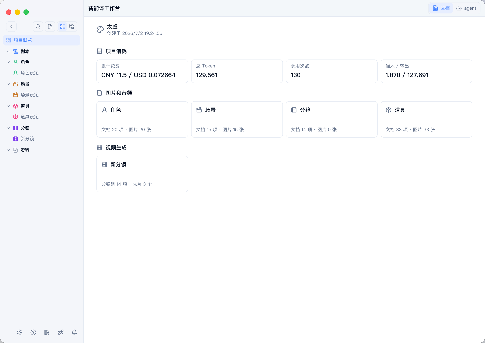
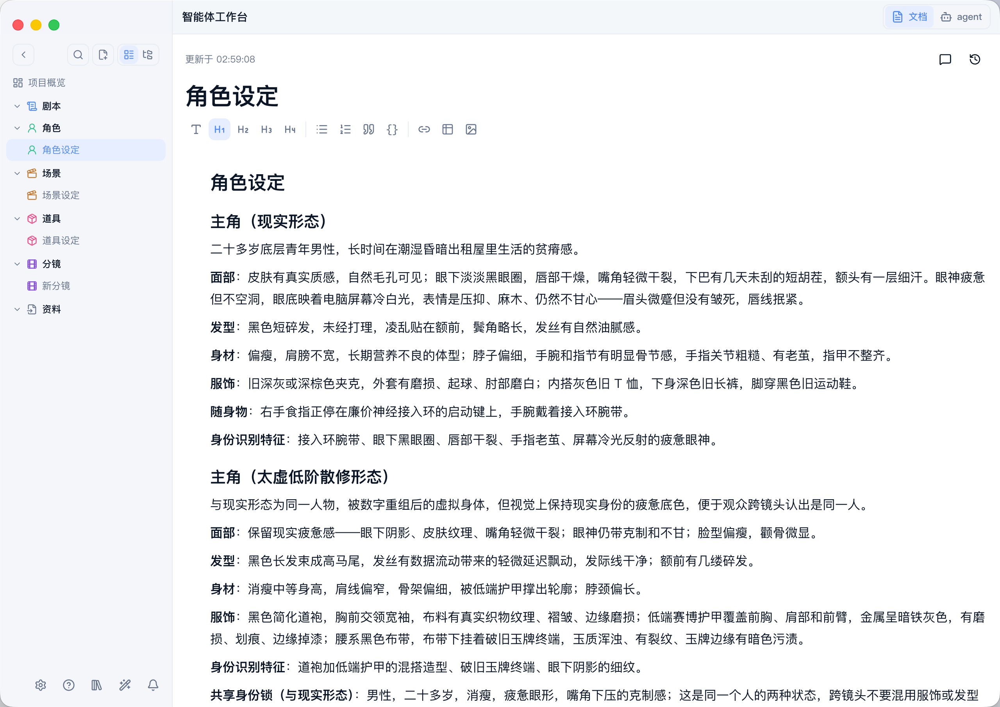
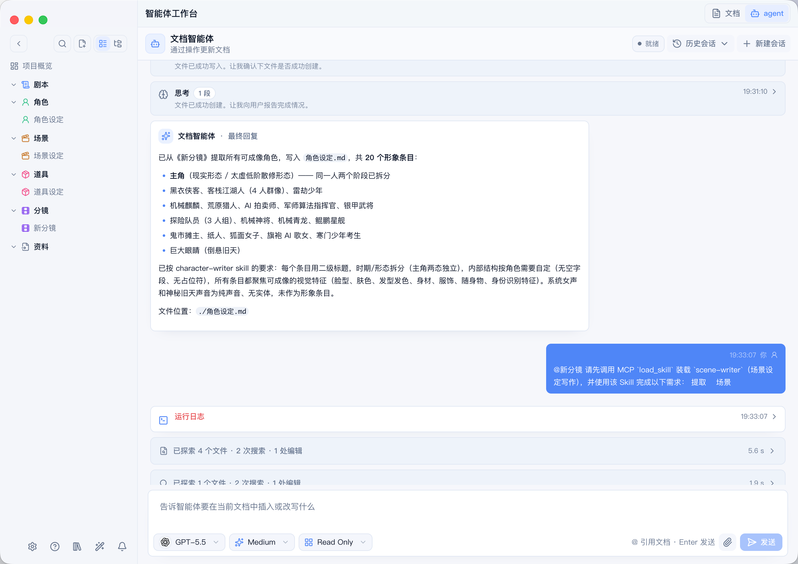
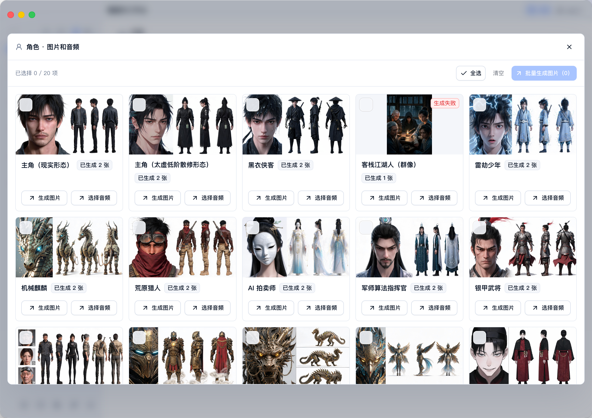

# MediaGo Drama

<div align="center">


**AI 漫剧创作 Agent 工作台**

让 Agent 持续推进从小说解析、剧本改写到角色、场景、分镜和视频生成的漫剧生产流程。

创作过程以本地文档保存在同一个项目中，让 Agent 能够持续理解上下文、复用创作资产，并把已经确认的内容继续用于图片和视频生成。

[](https://github.com/mediago-dev/mediago-drama/releases)
[](./LICENSE)
[](#项目状态与路线图)

[官方网站](https://mediago.torchstellar.com/) · [界面与演示](#界面与演示) · [创作流程](#创作流程) · [核心能力](#核心能力) · [快速开始](#快速开始)

</div>

---

## 目录

- [项目简介](#项目简介)
- [界面与演示](#界面与演示)
- [创作流程](#创作流程)
- [核心能力](#核心能力)
- [快速开始](#快速开始)
- [开发指南](#开发指南)
- [项目状态与路线图](#项目状态与路线图)
- [常见问题](#常见问题)
- [参与贡献](#参与贡献)
- [开源与商业边界](#开源与商业边界)
- [许可证](#许可证)

## 项目简介

### MediaGo Drama 是什么

MediaGo Drama 是一个面向漫剧生产的本地 Agent 工作台。它把原文、剧本、角色、场景、道具、分镜和生成素材组织成一个持续演进的创作项目，让 Agent 可以在同一份项目上下文中完成分析、改写、整理和生成任务。

产品围绕“原文 → 剧本 → 设定 → 分镜 → 素材 → 视频”的流程构建。创作者可以在任意阶段查看和编辑文档，也可以继续让 Agent 读取已有内容并推进后续工作。

### 为什么采用文档驱动

MediaGo Drama 不只保存最终生成的图片和视频，也保存这些结果所依据的创作内容：

- **上下文集中管理**：原文、剧情、角色、场景、道具和分镜共同组成项目事实来源。
- **创作过程可读可改**：中间产物以可读文档保存，创作者可以直接检查、修改和归档。
- **设定能够持续复用**：角色外观、场景规则、关键道具和视觉要求可以跨章节、跨分镜继续使用。
- **文档直接进入生成流程**：已确认的角色、场景和分镜可以继续用于图片与视频生成。
- **方法可以沉淀**：有效的写作规则、画风要求和提示词模板可以整理为 Skills，供后续项目继续使用。

## 界面与演示

以下界面来自《太虚》漫剧项目，展示了同一个项目从内容整理、Agent 协作到分镜视频生成的工作方式。

### 项目概览

项目概览集中展示角色、场景、道具、分镜和生成素材。每项内容都可以继续打开、编辑或进入生成流程。



### 创作文档

角色、场景、道具与分镜以结构化文档保存在项目中。文档既是创作者可以检查的生产资料，也是 Agent 执行后续任务时使用的上下文。



### Agent 工作台

Agent 会结合当前项目文档和对应 Skill，执行角色提取、场景整理、剧本改写、分镜拆解等任务。执行过程和结果都保留在项目工作区中。



### 分镜与视频生成

分镜文档中的镜头组可以直接进入视频工作区，统一查看已经生成的镜头、待生成任务和对应结果。



## 创作流程

### 从原文到成片

| 阶段 | 项目产物 | 后续用途 |
| --- | --- | --- |
| 1. 导入原文 | 小说、故事梗概或已有剧本 | 建立整个项目的内容基础 |
| 2. 解析剧情 | 事件顺序、人物关系、场景切换和关键道具 | 形成结构化的故事上下文 |
| 3. 改写剧本 | 分场剧本、动作描写和对白 | 明确戏剧节奏、人物动机和场景内容 |
| 4. 建立角色 | 外观、服饰、身份和识别特征 | 为跨镜头生成提供稳定的视觉要求 |
| 5. 建立场景与道具 | 环境设定、关键物件和生成提示词 | 构建可反复使用的世界观资产 |
| 6. 拆解分镜 | 主体、动作、运镜、光影、台词和时长 | 转换为可执行的图片与视频任务 |
| 7. 生成素材 | 角色图、场景图、道具图和镜头参考图 | 为分镜视频提供视觉素材 |
| 8. 生成视频 | 分镜视频、分集预览和生成历史 | 汇总镜头并检查整集效果 |

### 各阶段产生的项目文档

项目文档不是一次性的生成结果。原文提供事实，剧本明确戏剧表达，角色、场景和道具建立视觉约束，分镜再把这些内容组织成可以执行的镜头任务。后续阶段可以直接引用前面的文档，修改后的内容也会继续成为项目的一部分。

## 核心能力

### 文档驱动的本地创作工程

- 以 Markdown 等本地文件保存项目文档，方便阅读、搜索、编辑和归档。
- 在同一个项目中组织原文、剧本、角色、场景、道具和分镜。
- 让创作内容同时服务于人工编辑、Agent 任务和媒体生成。
- 支持基于已有项目文档继续创作，不必重新整理全部设定。

### 面向项目的 Agent 工作台

- Agent 可以读取当前项目和指定文档，并在项目上下文中执行任务。
- 支持为剧本、角色、场景、道具和分镜任务装载对应 Skills。
- 长任务的计划、执行过程、工具调用和文档修改可以在工作台中查看。
- 支持 Codex、OpenCode 等 Agent 运行时。

### 结构化的角色、场景、道具和分镜

| 资产 | 主要内容 |
| --- | --- |
| 剧本 | 场景标题、动作描写、对白和戏剧推进 |
| 角色 | 外观、身份气质、服饰道具和跨镜头识别特征 |
| 场景 | 环境、构图、光影、材质和生图提示词 |
| 道具 | 剧情功能、外观材质、使用关系和连续性标记 |
| 分镜 | 主体、动作、场景、运镜、光影、台词和时长 |

### 图片、视频与素材管理

- 围绕项目中的角色、场景、道具和分镜生成图片与视频。
- 支持参考素材、生成规格、模型选择和批量生成设置。
- 生成结果进入项目素材和历史记录，便于筛选、回看和再次引用。
- 分镜视频可以进入分集预览，集中检查不同镜头的生成结果。

### Skills 与提示词模板

剧本、角色、场景、道具和分镜等创作规则以 Skill 文件管理。内置规则可以直接使用，也可以根据题材、画风和制作规范进行调整。

| Skill | 作用 |
| --- | --- |
| `screenplay-writer` | 把小说叙述改写成分场剧本、动作与对白 |
| `character-writer` | 提取可成像的角色设定与跨镜头识别特征 |
| `scene-writer` | 生成可复用的场景设定与生图提示词 |
| `prop-writer` | 梳理关键道具的剧情功能、视觉细节和连续性 |
| `storyboard-writer` | 把小说或剧本拆解成面向视频模型的镜头组 |
| `novel-writer` | 撰写、续写、改写和润色小说正文 |
| `image-generation` | 组织图片生成参数、参考图和生成任务 |
| `video-generation` | 组织视频生成参数、首帧参考和生成任务 |

项目还提供角色概念图、多视图、场景氛围图、场景四视图和电影感镜头等提示词模板，并内置真人写实、2D 动漫、3DCG 动漫和 Q 版等风格预设。

### 模型路由

图片、视频和文本生成使用统一的模型目录与参数系统。模型能力与具体执行渠道分开管理，可以根据生成效果、成本和可用性选择不同路线，同时让创作文档和分镜任务保持一致。

## 快速开始

当前版本主要面向本地开发和工作流体验。

### 环境要求

| 工具 | 建议版本 | 说明 |
| --- | --- | --- |
| Node.js | 24 | 前端与脚本运行环境 |
| pnpm | 11.9+ | JavaScript 包管理工具 |
| Go | 1.25+ | 本地服务端运行环境 |
| go-task | 3.x | 项目任务编排工具 |

### 安装依赖

```bash
pnpm install
```

### 启动服务端和桌面端

开发环境需要同时启动本地服务端和 Electron 桌面端。分别打开两个终端：

```bash
# 终端 1
pnpm dev:server
```

```bash
# 终端 2
pnpm dev:desktop
```

修改服务端或相关 Go 模块后，运行 `pnpm build:server` 更新本地二进制。

### 创建第一个漫剧项目

1. 启动 MediaGo Drama，新建一个项目。
2. 导入小说、故事梗概或已有剧本，建立项目原文。
3. 在 Agent 工作台中选择对应 Skill，生成或整理剧本、角色、场景和道具。
4. 检查并调整项目文档，再将剧本拆解为分镜。
5. 为角色、场景和分镜生成参考图，并从分镜进入视频生成工作区。
6. 在分集预览中查看已生成镜头和整体效果。

## 开发指南

### 本地开发

根目录负责统一编排前端工作台、Go 服务端和 Electron 桌面端。完成依赖安装后，可以按照[快速开始](#快速开始)中的方式运行开发环境。

### 构建与检查

提交代码前执行完整构建和检查：

```bash
pnpm build
task check
```

### 测试

新增或修改功能时，请在对应模块补充测试，并运行工作区测试：

```bash
task test
```

### 模块开发文档

- [前端工作台](./apps/workspace/README.md)
- [本地服务端](./services/server/README.md)
- [核心生成能力](./packages/core/README.md)
- [创作指令](./packages/instructions/README.md)
- [剪映草稿](./packages/jianyingdraft/README.md)
- [工具包](./packages/tools/README.md)

## 项目状态与路线图

### 当前已经具备的能力

MediaGo Drama 目前处于持续迭代阶段，已经具备本地项目管理、创作文档编辑、Agent 协作、Skills 与提示词模板、素材管理，以及图片、视频和文本生成工作区。

### 后续发展方向

项目的长期目标是让 Agent 7×24 小时持续推进漫剧生产。后续将继续完善任务编排、质量检查、成本控制、批量生产和桌面端使用体验，让从内容整理到成片输出的流程更加完整。

## 常见问题

### 当前版本应该如何体验？

当前版本以本地开发和工作流体验为主。安装环境与依赖后，同时启动服务端和 Electron 桌面端即可使用。

### Agent 可以生成哪些内容？

Agent 可以围绕项目原文生成或整理剧本、角色、场景、道具和分镜文档，并继续基于这些文档组织图片与视频生成任务。

### 如何调整剧本规则、画风或提示词？

可以在 Skills 和提示词模板中调整对应规则。不同题材或制作规范可以使用不同的 Skill 与模板组合。

### 修改服务端代码后为什么没有生效？

修改服务端或相关 Go 模块后，需要运行 `pnpm build:server` 更新本地二进制，再重新启动开发环境。

## 参与贡献

### 提交 Issue

如果发现问题或有功能建议，欢迎在 [GitHub Issues](https://github.com/mediago-dev/mediago-drama/issues) 中提交。请尽量附上复现步骤、运行环境和相关截图或日志。

### 开发与 Pull Request

1. Fork 仓库并创建独立分支。
2. 按照现有目录约定和代码风格完成修改。
3. 为新增或修改的行为补充测试。
4. 运行 `task check` 和 `task test`。
5. 提交 Pull Request，并说明改动目的、实现范围和验证结果。

## 开源与商业边界

本仓库中的自有源码采用 Apache License 2.0。MediaGo 官方发行版可能同时包含本仓库之外的专有组件，并接入账户、商城、托管、支付、授权等独立商业服务。

这些商业组件与服务不属于本仓库开源许可证的授权范围，也不会改变 Apache-2.0 已经授予的权利。详细说明请参阅[《MediaGo 商业功能与服务说明》](./COMMERCIAL_FEATURES.md)。

## 许可证

本仓库自有源码采用 [Apache License 2.0](./LICENSE)。在遵守许可证条款的前提下，可以使用、修改和分发本仓库中的开源代码，也可以用于商业用途。第三方依赖仍分别遵循其原始许可证。
