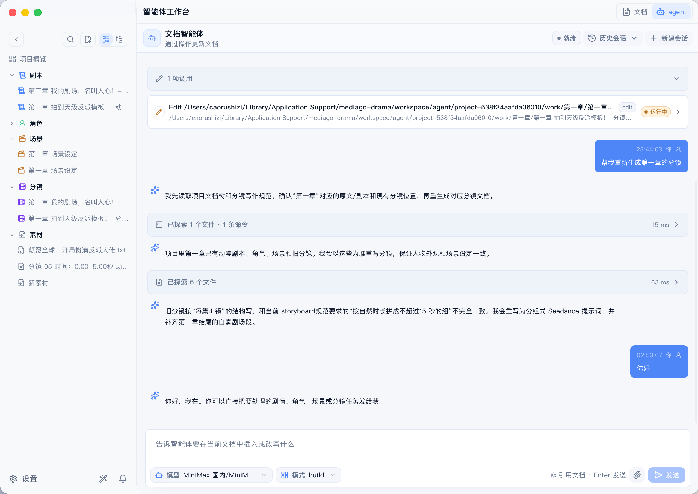
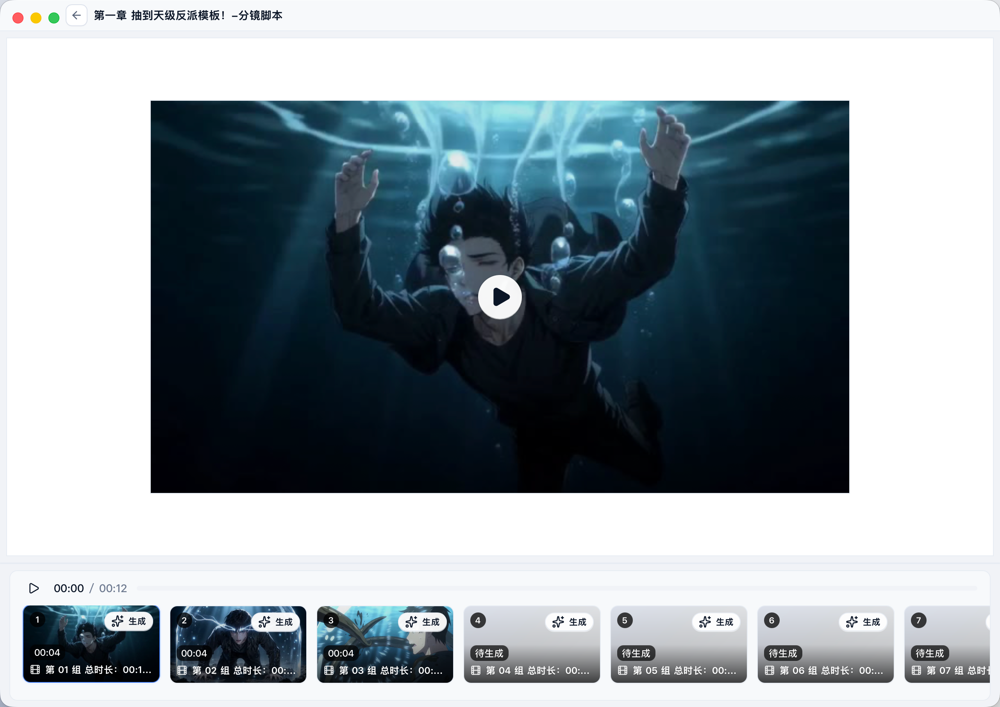
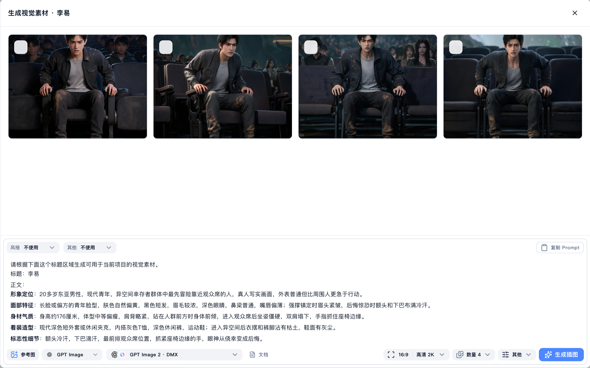
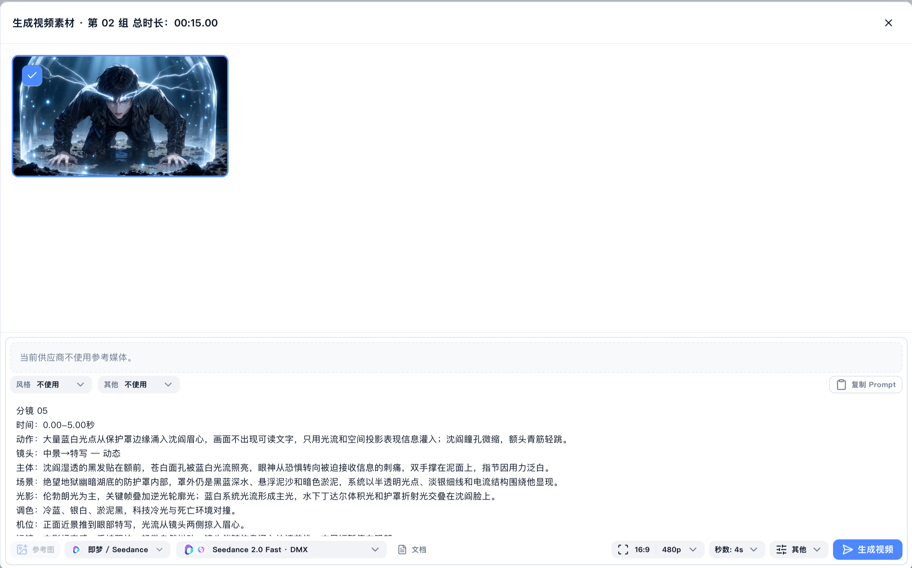

# MediaGo Drama - 小说改短剧 Agent 工作台

<div align="center">

**小说改短剧，从文本到视频的一站式 Agent 工作台。**

把小说、剧本、角色、场景、道具、分镜和生成素材放在同一个创作上下文中，让 Agent 按内置 Skills 与提示词模板推进短剧生产。

[项目简介](#项目简介) • [界面预览](#界面预览) • [核心流程](#核心流程) • [功能特性](#功能特性) • [内置-skills](#内置-skills) • [快速开始](#快速开始)

</div>

---

## 项目简介

MediaGo Drama 面向小说改短剧与 AI 视频短剧打样场景。它把原文解析、剧本改写、角色提炼、场景设定、道具设定、分镜拆解、图片生成和视频生成串成一条连续工作流，帮助创作者从一段文本快速得到可拍、可画、可生成的视频资产。

与普通聊天式创作工具不同，MediaGo Drama 更关注“项目级上下文”。Agent 不只是回答问题，而是在工作区中读取原文、理解已有设定、调用文档工具、按 Skill 写入剧本/角色/场景/道具/分镜，并把这些资产继续送入图片与视频生成流程。

项目采用本地优先设计。剧本、角色、场景、道具、分镜、提示词、参考素材和生成结果都会沉淀在同一个项目中，方便持续改稿、复用设定、追踪生成历史，并把团队经验沉淀成可编辑的 Skills 和提示词模板。

## 界面预览

<table>
  <tr>
    <td width="50%" align="center">
      <strong>Agent 工作台</strong><br />
      
    </td>
    <td width="50%" align="center">
      <strong>分镜视频预览</strong><br />
      
    </td>
  </tr>
  <tr>
    <td width="50%" align="center">
      <strong>图片生成</strong><br />
      
    </td>
    <td width="50%" align="center">
      <strong>视频生成</strong><br />
      
    </td>
  </tr>
</table>

## 核心流程

| 阶段 | 产物 | 价值 |
| --- | --- | --- |
| 1. 导入原文 | 小说、故事梗概、短剧文案 | 建立项目事实来源，避免后续创作失去依据 |
| 2. 剧情解析 | 事件顺序、人物关系、场景切换、关键道具 | 把长文本整理成可改编的结构化上下文 |
| 3. 剧本改写 | 分场剧本、动作描写、对白 | 将小说叙述转成可拍摄、可表演的短剧文本 |
| 4. 角色设定 | 外观、服饰、身份、标志性细节 | 保持角色图、分镜和视频中的人物一致性 |
| 5. 场景设定 | 场景名称、环境描述、生图 Prompt | 为场景图、氛围图和镜头背景提供稳定素材 |
| 6. 道具设定 | 剧情功能、外观材质、使用方式、连续性标记 | 锁定关键物件在角色、场景和分镜中的视觉一致性 |
| 7. 分镜拆解 | 分镜组、镜头描述、运镜、光影、台词、时长 | 输出可直接服务视频模型的镜头级提示词 |
| 8. 生成视频 | 参考图、分镜视频、生成历史 | 将文本资产推进到图片/视频生成与项目沉淀 |

## 功能特性

### 原文解析

- 面向小说、故事梗概和短剧文案，梳理事件顺序、人物出场、情绪转折、场景切换和关键道具。
- 将长文本拆成短剧生产可复用的上下文，后续写剧本、补角色、补场景、补道具、拆分镜都可以继续引用。
- 适合小说改短剧、文章改视频、故事梗概扩写和 AI 视频前期策划。

### 短剧资产生成

- **剧本**：按短剧可读格式输出场景标题、动作描写、对白和戏剧推进。
- **角色**：提炼人物外观、身份气质、服饰道具和跨镜头一致性标识。
- **场景**：生成高辨识度、纯净、可直接用于图像模型的场景设定。
- **道具**：梳理关键物件的剧情功能、视觉细节、使用关系和连续性标记。
- **分镜**：把剧本或原文拆成镜头级分镜，包含主体、动作、场景、运镜、光影、台词和时长。

### 图片与视频生成

- 内置图片、视频、文本生成工作区，支持围绕角色、场景、道具和分镜持续生成素材。
- 分镜提示词可继续用于视频生成，形成从原文解析到视频片段的闭环。
- 生成结果会进入项目资产和历史记录，便于筛选、复用、回看和二次迭代。

### Agent 工作台

- Agent 可以读取项目文档、理解当前上下文、调用 MCP 工具，并把结果写回工作区。
- 创作者负责给方向和做判断，Agent 负责执行长链路任务，例如重写分镜、补齐角色、整理场景、提炼道具、生成提示词。
- 支持 Codex / Opencode 等 Agent 运行时，便于探索不同智能体协作模式。

### Skills 与提示词沉淀

- 剧本、角色、场景、道具、分镜等创作规则以 Skill 文件形式管理，可查看、覆盖和扩展。
- Agent 行为、工具调用规则、长文档写入策略和生成提示词都通过模板沉淀。
- 团队可以把验证有效的短剧生产方法沉淀为稳定流程，而不是反复手写零散 Prompt。

### 本地优先与 MCP 扩展

- 项目资产优先保存在本地工作区，创作数据和生成上下文更可控。
- 通过 MCP 接入文档能力、外部工具、模型服务和自动化流程。
- 适合个人创作者做快速打样，也适合团队探索私有化短剧生产工作流。

## 内置 Skills

内置 Skills 位于 `packages/server/configs/skills/builtin/`，服务端会作为默认能力加载。

| Skill | 标题 | 作用 |
| --- | --- | --- |
| `screenplay-writer` | 剧本写作 | 约束剧本格式，输出场景标题、动作描写、对白和节奏推进 |
| `character-writer` | 角色设定写作 | 从小说剧情中提炼可成像的角色外观描述词，保持跨镜头一致 |
| `scene-writer` | 场景设定写作 | 生成纯净、高辨识度、可直接用于生图的场景 Prompt |
| `prop-writer` | 道具设定写作 | 提炼关键道具的剧情功能、视觉细节、使用方式和连续性标记 |
| `storyboard-writer` | 分镜脚本写作 | 将小说、剧本或故事梗概拆成面向视频模型的电影级镜头提示词 |

## 提示词模板与提示词库

项目内置多类提示词资产，覆盖 Agent 规范、工具使用、角色图、场景图和视频镜头生成。

| 类型 | 路径 | 内容 |
| --- | --- | --- |
| Agent 模板 | `packages/server/configs/templates/prompts/AGENTS.md` | 创作工作区中的 Agent 行为约束 |
| 工具模板 | `packages/server/configs/templates/prompts/TOOLS.md` | 长文档写入、分批编辑、文档分类等工具调用规则 |
| 提示词库 | `packages/server/configs/prompt-library/builtin/` | 角色概念图、多视图、场景氛围图、四视图、电影感镜头等 |
| 风格预设 | `packages/server/configs/style-presets/builtin/` | 真人写实、2D 动漫、3DCG 动漫、Q 版风格 |

## 技术架构

```text
apps/workspace/      React + Tauri 创作工作台
packages/server/     Go API 服务、Agent 编排、内置 Skills 与提示词模板
packages/core/       图像/视频/文本生成路由、模型参数和供应商运行时
packages/mcp/        MCP 协议、文档工具和外部能力接入
packages/tools/      本地媒体工具封装
packages/vendor/     Agent 与 FFmpeg 等外部二进制准备
```

## 快速开始

### 环境要求

| 工具 | 建议版本 | 说明 |
| --- | --- | --- |
| Node.js | 20+ | 前端与脚本运行环境 |
| pnpm | 10.14+ | 包管理工具 |
| Go | 1.25+ | 服务端与 MCP 模块 |
| go-task | 3.x | 项目任务编排 |

### 安装依赖

```bash
pnpm install
```

### 启动开发环境

```bash
pnpm dev
```

该命令会准备 Agent 与媒体工具，启动 Go 服务端，并启动 `apps/workspace` 前端工作台。

### 常用命令

```bash
pnpm workspace:dev    # 仅启动前端工作台
pnpm dev:server       # 仅启动服务端
pnpm dev:desktop      # 启动 Tauri 桌面端
pnpm build            # 构建完整项目
pnpm check:go         # 检查 Go packages
```

## 适用场景

- 小说改短剧：从长文本中自动拆出剧情、角色、场景、道具和分镜。
- AI 视频打样：把分镜提示词快速转为视频片段，验证画面和节奏。
- 角色/场景/道具资产生产：批量生成角色概念图、角色多视图、场景氛围图、场景四视图和道具设定。
- 团队 Prompt 沉淀：把稳定有效的创作方法沉淀为 Skills 和提示词模板。
- 私有化创作工作台：在本地优先的环境中管理短剧项目资产和生成历史。

## 项目状态

MediaGo Drama 当前处于业务迭代阶段，已经内置短剧创作 Skills、提示词模板、提示词库、风格预设、MCP 文档工具和图像/视频/文本生成工作区。后续会继续围绕小说理解、分镜编排、视频生成和资产管理完善完整生产闭环。
