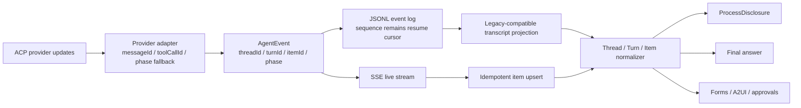

# Agent Thread / Turn / Item 重构设计

## 目标

把 Agent 对话从“平铺消息 + 组件猜测”升级为明确的 `Thread → Turn → Item` 语义，并以此实现 Codex 风格的过程披露：运行中自动展开，成功完成后自动折叠，失败或中断保持展开；最终回复和需要用户操作的界面始终位于过程区之外。

这不是单纯的样式调整。协议、服务端事件投影、前端兼容层、折叠状态机和视觉呈现必须使用同一套身份与生命周期，否则断线重连、历史恢复或虚拟列表卸载后仍会出现错分、重复和状态丢失。

## 需求与约束

### 功能需求

- `sessionId` 是 Thread 身份，每次用户提交形成一个 Turn。
- reasoning、plan、tool、file change、command、runtime log 和 commentary 属于过程区。
- `agent_message.phase=final_answer` 属于最终回复区。
- form、非 permission A2UI 和权限审批属于交互区，不能被过程折叠隐藏。
- 一个 Turn 只有一个顶层过程披露；工具调用允许在过程区内二级展开详情。
- 用户手动展开或关闭优先于自动规则；焦点仍在过程内容内时不能自动卸载。
- 旧 JSONL、旧平铺消息和缺少 phase 的 ACP 事件必须可读，不进行破坏性历史迁移。

### 非功能需求

- 保留现有 SSE 数字 sequence、重复事件过滤、gap 重同步、分页 replay、终态轮询兜底和权限恢复链路。
- 同一个 `turnId + itemId` 的 started / delta / completed 必须幂等更新，不能产生重复行。
- 文本增量缓冲按 `turnId:itemId:phase` 隔离，不能只按 run 聚合。
- 历史投影可渐进升级；旧客户端不应因新增带 sequence 的未知事件类型持续触发 gap。
- 时间线继续虚拟化，规范化投影对当前最多 300 条消息保持线性复杂度。
- 折叠按钮具备 `aria-expanded`、`aria-controls`、清晰焦点态和键盘可操作性。

## 选定架构

采用“协议语义底座 + Turn 级 ProcessDisclosure”的组合方案。



`sessionId` 直接作为 Thread ID，`runId` 直接作为 Turn ID，不另造平行身份。ACP 的 `AgentMessageChunk.MessageId`、`AgentThoughtChunk.MessageId` 和 `toolCallId` 优先作为 Item ID；provider 未提供时，adapter 在一个连续段开始时生成稳定 ID。计划项使用稳定的 Turn 级 ID，其他持久化动作使用事件 ID。

迁移期保留现有 `messages` 作为兼容载体，但新增的 `turnId`、`itemId`、`phase` 是正式字段，不再藏在开放式 metadata 中。Timeline 只消费规范化的 Turn View Model；旧消息只允许在单一 legacy adapter 中推导语义，组件本身不得再用 Markdown 或内容长度判断 final。

## 领域模型

```ts
type AgentMessagePhase = "commentary" | "final_answer";

interface AgentItemIdentity {
  threadId?: string;
  turnId: string;
  itemId: string;
  phase?: AgentMessagePhase;
}

interface AgentTurnViewModel {
  id: string;
  userMessage?: AgentMessage;
  lifecycle: "pending" | "in_progress" | "waiting" | "completed";
  outcome: "succeeded" | "failed" | "interrupted" | "cancelled" | "refused" | null;
  startedAt?: string;
  completedAt?: string;
  durationMs?: number;
  processItems: AgentMessage[];
  finalAnswerItems: AgentMessage[];
  interactionItems: AgentMessage[];
}
```

兼容分类规则如下：

| 输入 | lane |
|---|---|
| thought / plan / tool / file / patch / diff / terminal | process |
| visible runtime log | process |
| assistant message + `phase=commentary` | process |
| assistant message + `phase=final_answer` | final |
| legacy 普通 assistant message | final |
| form / 非 permission A2UI | interaction |
| 普通 transient runtime trace | hidden |

包含 `<think>` 的旧普通消息在 adapter 中拆成确定性 reasoning item 与剩余 final item。短 final 和长 commentary 都只看 phase，不看长度或 Markdown 结构。

## 生命周期与折叠状态机

```ts
type DisclosureOverride = "auto" | "manual-open" | "manual-closed";
```

自动展开规则：

- pending / in_progress / waiting：展开。
- completed + succeeded / cancelled / refused：折叠。
- completed + failed / interrupted：展开。
- 焦点仍在 disclosure 内：保持展开，失焦后再应用自动折叠。
- manual-open / manual-closed：始终覆盖自动判断，只有出现新的 turnId 才回到 auto。

手动状态由 `AgentTimeline` 顶层按 turnId 保存，不能放在 Virtuoso 行内部。这样行被虚拟列表卸载、历史 hydrate 或工具更新时，用户选择不会意外丢失。

## 数据流与兼容迁移

1. Provider adapter 读取 ACP messageId / toolCallId，并为旧 provider 补稳定 fallback。
2. AgentEvent 增量新增 turnId、itemId、phase 和 outcome；SSE 的 `id:` 仍是数字 sequence。
3. 服务端投影以 `turnId + itemId` 幂等更新消息，旧事件缺字段时使用 `sessionId/runId/eventId` 推导。
4. GET chat 在迁移期同时保留 flat messages；新前端优先显式字段，缺失时走 legacy adapter。
5. 前端 delta buffer 改为 item 维度，completion 只结束目标 item，工具出现不再隐式结束无关消息。
6. Timeline 生成按 Turn 排列的视图模型，分别渲染 process、final、interaction。

不增加旧客户端完全不认识的 sequenced `agent.item.*` 事件类型。新增语义优先附着在现有 `agent.message.*`、`agent.acp` 与 terminal event 上，降低灰度升级期间的 gap 风险。

## ACP phase 适配

ACP v0.13.5 提供 messageId，但没有 commentary / final_answer。适配规则是：thought、tool、plan、runtime 永远是 commentary；普通 assistant 文本先作为当前候选段，如果之后出现过程项，该段归为 commentary；Turn 正常结束时最后一段归为 final_answer。

停止原因映射：

| ACP stopReason | Turn lifecycle | outcome |
|---|---|---|
| end_turn / 空 | completed | succeeded |
| cancelled | completed | cancelled |
| max_tokens | completed | interrupted |
| max_turn_requests | completed | interrupted |
| refusal | completed | refused |
| runner error | completed | failed |

## 视觉方向

方向是“克制、连续、低表面感”：过程内容是一条正文流，不再为 thought、plan 和每个工具各铺一张卡。顶层 header 使用低对比文本与轻量 chevron，展开内容只有一条细分隔线；过程行通过图标、动词和二级文本建立层次。最终回复使用普通内容排版，和过程区保持明显间距，但不根据内容长短切换成另一套视觉组件。

现有设计 token、亮暗主题和 Markdown/代码块能力继续复用。新增颜色必须进入 `tokens.css` 的语义层，组件和 agent 样式不写新的 hex/rgb。动效只用于 chevron、内容显隐和运行中状态，并尊重 reduced-motion。

## 失败模式与缓解

| 风险 | 缓解 |
|---|---|
| 重连重复 item | 继续使用 sequence 去重，并用 turnId + itemId 幂等 upsert |
| gap 后旧 snapshot 覆盖 live 状态 | 保留现有 authoritative resync 规则，运行中 snapshot 只按稳定 item ID 合并 |
| provider 缺 messageId | adapter 在连续段首次出现时生成一次 fallback，不能每 chunk 生成 |
| 历史缺 phase | 单一 legacy adapter 做确定性分类，组件禁止启发式猜测 |
| 完成时焦点被卸载 | focus-within 暂缓自动折叠 |
| permission replay 复活旧按钮 | 继续由独立 pending permission 集合拥有交互，timeline 中 suppression 不变 |
| 文本 delta 未持久化导致过程顺序丢失 | 合并后持久化现有 message 事件，或在现有事件类型上写入段完成语义 |

## ADR-001：以 Turn / Item 语义替代组件级消息猜测

**状态：** Accepted

**决定：** 以 sessionId、runId 和 provider item ID 建立 Thread / Turn / Item 语义；UI 只消费规范化 Turn View Model。SSE sequence 继续作为传输游标，不承担 Item 身份。

**正向影响：** final/commentary、生命周期、折叠和重放拥有一致语义；组件显著简化；provider adapter 可独立演进。

**负向影响：** 迁移期需要双读和旧消息 adapter；协议、Go 投影和 TypeScript mirror 必须同步修改；状态测试数量增加。

**否决方案：**

- 只改 CSS：无法解决 final 猜测、自动折叠和重连重复。
- 继续以 message kind 分组：没有 Turn outcome，也无法可靠区分 commentary/final。
- 一次性重写历史 JSONL：风险高、没有必要，且不利于回滚。

## 验收标准

- 运行中的 Turn 默认展开，成功完成后自动折叠；失败和中断保持展开。
- 最终回复、表单和审批永远不在过程折叠内容中。
- 一个 Turn 只有一个顶层过程披露，工具仅有二级详情。
- 用户手动状态跨工具更新和 Virtuoso 卸载保持；焦点不会因自动折叠丢失。
- 历史旧消息和新显式 phase 消息都能稳定分类，且不再调用长度/Markdown final heuristic。
- sequence/replay/gap/permission/form 现有回归测试继续通过。

## 参考

- OpenAI Codex App Server：<https://developers.openai.com/codex/app-server>
- Codex 产品页面：<https://openai.com/codex/>
- Introducing the Codex app：<https://openai.com/index/introducing-the-codex-app/>
