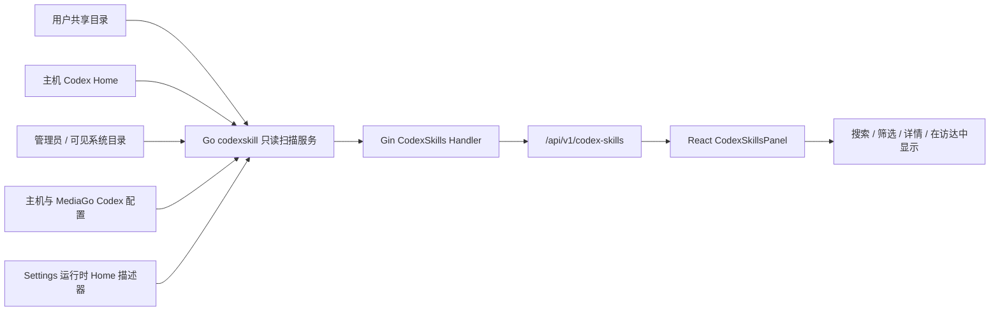

# Codex 全局 Skill 只读展示与可用性诊断设计

## 状态

Implemented。需求范围已经确认为“只读展示 + 可用性诊断”，不包含创建、编辑、删除、移动、启用或禁用 Skill。

## 背景与调研结论

MediaGo Drama 现有 `/api/v1/skills` 和 `SkillsEditorPanel` 管理的是提示词包中的应用内 Skill，数据来自 PackStore/SQLite。它们不是 Codex 从本机文件系统发现的 Skill，因此不能扩展现有 `SkillMeta.source = pack | user` 来混装 Codex Skill，否则会混淆生命周期、权限和删除语义。

Codex 官方当前把 `$HOME/.agents/skills` 定义为用户级共享目录，把仓库中的 `.agents/skills` 定义为项目级目录；管理员 Skill 位于 `/etc/codex/skills`，系统 Skill 由 Codex 随产品提供。官方同时说明同名 Skill 不会合并，可能在选择器中同时出现，并支持符号链接目录。参考：[Build skills](https://learn.chatgpt.com/docs/build-skills.md)。

本机环境还实际存在 `${CODEX_HOME:-$HOME/.codex}/skills`。当前 Codex loader 仍兼容该目录，但它已经属于兼容/弃用来源。MediaGo 在启用 Codex 中转时会为 Codex ACP 设置工作区隔离的 `CODEX_HOME`，所以默认 Codex Home 下的 Skill 不一定会被 MediaGo 内启动的 Codex 加载。`$HOME/.agents/skills` 不依赖这个 Codex Home 隔离，是 App、CLI 与 MediaGo 之间共享个人 Skill 的推荐位置。页面只能代表 MediaGo 服务进程检测到的 Home/Codex Home；App 或某个 shell CLI 使用不同 `CODEX_HOME` 时，其结果可能不同。

## 目标

1. 在设置页展示 MediaGo 服务所在设备上可发现的 Codex 全局 Skill。
2. 分别诊断 Skill 对普通 Codex App/CLI 和 MediaGo Codex 运行时的预计可用性。
3. 明确指出无效 frontmatter、禁用配置、未共享目录、同名冲突和根目录读取失败。
4. 支持查看原始 `SKILL.md` 和在桌面端定位文件，但不修改任何文件。
5. 与现有“提示词包”设置完全隔离。

## 非目标

- 不管理项目 `.agents/skills`；首版页面只处理全局来源。
- 不扫描 Codex 插件缓存。插件安装状态具有独立生命周期，缓存目录不是稳定公共契约。
- 不展示 ChatGPT 工作区或云端 Skill；它们与本地文件系统 Skill 是不同的分发和权限边界。
- 不声称通过静态扫描证明 Skill 已被某个正在运行的 Codex 会话加载。页面展示的是基于官方发现规则和当前配置的“预计可用性”。
- 不执行 Skill 中的脚本，不遍历 `scripts/`、`references/` 或 `assets/` 的内容。

## 功能需求

### 发现来源

| 来源 | 扫描位置 | App/CLI 预计可用性 | MediaGo 预计可用性 |
|---|---|---|---|
| 用户共享 | `$HOME/.agents/skills/**/SKILL.md` | 有效且未禁用时可用 | 有效且符合当前运行时产品策略时可用；隔离中转配置由 MediaGo 重建，不沿用主机的 Skill 启停规则 |
| Codex Home（兼容） | `${CODEX_HOME:-$HOME/.codex}/skills/**/SKILL.md` | 有效且未禁用时可用 | 仅当 MediaGo 运行时使用同一 Codex Home，或同一规范化 Skill 也通过共享来源被发现时可用 |
| 管理员 | `/etc/codex/skills/*/SKILL.md`（Unix，存在时） | 有效时可用 | 有效时可用 |
| 本机可见内置项 | 已扫描 Codex Home 下可辨识的 `.system` 子树 | 取决于当前 Codex 安装 | 仅在能确认运行时同源时可用，否则未知 |

为贴近当前捆绑 Codex loader，用户、兼容和管理员根从根本身开始递归收集每一层的 `SKILL.md`，父目录已经是 Skill 时也不剪枝；最大深度为 6，并设置每根最多 2,000 个目录和 20,000 个目录项的上限。用户、兼容和管理员来源允许目录符号链接，但各来源都忽略直接指向文件的 `SKILL.md` 符号链接；系统来源不跟随目录符号链接。同一规范化 `SKILL.md` 被多个入口发现时合并为一个条目并保留全部来源别名，避免把同一物理 Skill 错报成冲突；不同规范化路径但同名的 Skill 不合并。

### 解析与诊断

每个 Skill 解析以下信息：

- `SKILL.md` frontmatter 的 `name`、`description`；两者按当前 loader 压缩为单行。空 `name` 回退为 Skill 目录名并给出兼容警告，空 `description` 仍为无效。对当前 Codex 会修复的未加引号冒号和 flow-like scalar 保持兼容。
- `agents/openai.yaml` 中可选的 `interface.display_name`、`short_description`、`default_prompt`、`policy.allow_implicit_invocation`、`policy.products` 和工具依赖摘要。`display_name` 未声明时由前端回退到 frontmatter `name`，不使用可能带版本号的物理目录名。产品只接受 `chatgpt`、`codex`、`atlas` 及其全大写别名；该可选文件解析或枚举校验失败时整体 fail-open，只丢失 UI metadata，不使 Skill 本身无效。
- 是否包含 `scripts`、`references`、`assets`，只做目录存在性判断。
- 主机 Codex 配置中的有序 `[[skills.config]]` 规则：支持规范化后的精确 `SKILL.md` 文件 `path` 或 `name` 选择器，后匹配规则覆盖前规则；目录路径不会自动补成 `SKILL.md`。另读取 `[skills.bundled].enabled` 作为系统 Skill 总开关。MediaGo 隔离中转目录的配置由服务重建且不包含主机的 Skill 规则，因此诊断不能读取其中可能残留的旧配置。
- 同名 Skill 数量、入口是否为符号链接、语法错误和来源读取错误。

可用性状态固定为：

- `available`：按当前发现规则预计可用。
- `disabled`：对应表面的 Codex 配置明确禁用。
- `not_shared`：普通 App/CLI 可见，但 MediaGo 的隔离 Codex Home 不会发现。
- `invalid`：`SKILL.md` 缺失或不可读、frontmatter 缺失或必填字段无效。文件超过页面预览上限时仍可有效，只是不返回原始正文。
- `unknown`：系统/安装来源无法从稳定规则确认，或运行时上下文读取失败。

每个状态必须带稳定的 `reasonCode` 和中文说明，前端不能通过字符串猜测状态。

## 高层架构



新增 `internal/service/codexskill`，不复用现有 `internal/service/skill.Registry`。扫描服务接收可注入的 Home、环境变量、运行时 Home 提供器和文件大小限制，以便在临时目录中做确定性测试。

`settings` 服务新增一个纯读取的 MediaGo Codex Home 描述方法。它复用现有 `activeCodexRelayProfile` 判定：中转真正处于可用配置时返回工作区隔离 Home；未配置中转时不返回覆盖值，由扫描服务使用主机 Codex Home。该方法不得创建目录或写入 `config.toml/auth.json`。

## API 契约

### `GET /api/v1/codex-skills`

返回列表、来源根诊断、汇总和扫描时间：

```json
{
  "generatedAt": "2026-07-14T12:00:00Z",
  "summary": {
    "total": 12,
    "mediaGoAvailable": 9,
    "needsAttention": 2,
    "unknown": 1
  },
  "roots": [
    {
      "source": "user_shared",
      "displayPath": "~/.agents/skills",
      "exists": true,
      "readable": true,
      "mediaGoVisible": true
    }
  ],
  "issues": [],
  "skills": [
    {
      "id": "stable-path-hash",
      "name": "release-check",
      "displayName": "Release Check",
      "description": "Validate a release before publishing.",
      "source": "user_shared",
      "displayPath": "~/.agents/skills/release-check/SKILL.md",
      "linked": false,
      "valid": true,
      "sameNameCount": 1,
      "appCli": { "state": "available", "reasonCode": "user_shared" },
      "mediaGo": { "state": "available", "reasonCode": "user_shared" },
      "allowImplicitInvocation": true,
      "hasScripts": false,
      "hasReferences": true,
      "hasAssets": false,
      "dependencyCount": 0
    }
  ]
}
```

根目录不可读时仍返回 `200` 和其他来源的结果，把错误放入 `roots[].error` 与 `issues`。只有服务未初始化、请求取消等无法形成可信响应的情况才返回 `500`。

### `GET /api/v1/codex-skills/:id`

重新扫描已知入口并按稳定 ID 查找，返回列表元数据、仅详情需要的绝对路径和受限大小的原始 `SKILL.md`。ID 由规范化 Skill 身份生成，接口只接受固定长度/字符集的不可逆 ID，不接受路径参数，从而避免任意文件读取。Skill 在两次请求间消失时返回 `404`。列表不返回绝对路径，降低服务绑定到非 loopback 地址时泄露主机目录结构的风险。

## 页面设计

设置侧栏在“生成配置”分组增加“Codex 技能”，放在“Codex 中转”之后、“智能体指令”之前。它始终可见，不随当前 Agent backend 隐藏，因为页面表达的是设备级资产清单，而不是中转专属配置。

页面使用现有 `SettingsPanelLayout`：

1. 标题“Codex 全局技能”，说明“只读展示 MediaGo 服务进程所在设备检测到的 Codex Skill；App/CLI 使用不同 CODEX_HOME 时结果可能不同；与提示词包相互独立”。
2. 右上角“重新扫描”按钮，通过 SWR `mutate()` 重新请求，不引入文件监听。
3. 顶部紧凑汇总：总数、MediaGo 预计可用、需处理、未确认。
4. 搜索框与状态筛选：全部、MediaGo 可用、需处理；来源筛选：全部、个人共享、Codex Home、管理员、系统。
5. 主区域为左右两栏。左侧是可键盘选择的 Skill 列表；右侧展示名称、描述、两端可用性、来源、路径、调用策略、依赖摘要和原始 `SKILL.md`。
6. 原始内容使用可聚焦、可滚动的纯文本代码区域，不渲染外部图片、HTML 或可点击 Markdown。桌面端提供“在文件管理器中显示”，浏览器模式不显示该操作。

状态不能只依赖颜色，必须同时显示“可用”“已禁用”“未共享”“无效”“未确认”文本和诊断原因。搜索框有可见标签或 `aria-label`，列表项使用 button/roving focus，刷新和详情 loading 使用 `aria-busy`。

### 页面状态

- Loading：汇总和列表骨架，保留页面标题。
- Empty：说明未发现全局 Skill，并推荐创建到 `~/.agents/skills/<name>/SKILL.md`。
- Partial error：顶部警告列出不可读来源，仍展示成功来源。
- Fatal error：错误说明和“重试”按钮。
- Detail stale/404：清除已失效选择，提示 Skill 已移动或删除，并刷新列表。

## 安全与非功能要求

- 列表扫描目标：本机常见规模下 p95 小于 500ms；不为首版引入缓存或 watcher。
- `SKILL.md` 原始正文预览上限为 256 KiB；超过时仍从有界前缀解析 frontmatter，并显示 `preview_unavailable`。`agents/openai.yaml` 最大读取 64 KiB，超过时只丢失可选 UI metadata，不使 Skill 本身无效。
- 不执行脚本，不解析资源正文，不根据 Markdown 自动发起网络请求。
- 列表扫描只保留解析后的元数据，不为全部 Skill 常驻保存原始正文；详情接口重新校验后，只读取当前选中项的有界预览。
- 只在预定义来源根内做深度与数量均受限的递归发现；详情请求不能指定文件路径。
- 用户、兼容和管理员根按受限深度跟随目录符号链接；系统根不跟随；所有来源忽略 `SKILL.md` 文件符号链接和 FIFO、设备等非普通文件。每次详情读取前重新发现、规范化和校验。
- 列表中的路径统一使用 `~`、`$CODEX_HOME` 或 `$ADMIN_SKILLS/<n>` 等符号化表示；只有详情响应包含绝对路径，供桌面端定位文件。
- 一个来源失败不影响其他来源；所有内部错误保留上下文用于日志，公开信息不包含文件内容或配置密钥。
- 稳定排序：MediaGo 可用项优先，其次来源优先级、展示名称、入口路径。同名项不合并，显示冲突标记。

## ADR-001：使用 Go 侧文件系统扫描，而不是调用 Codex CLI 或 Electron IPC

### 状态

Accepted。

### 决策

由现有 Go sidecar 提供独立的只读扫描服务和 HTTP API。React 只消费结构化结果；Electron 仅复用已有的 `revealPath` 能力。

### 正面影响

- Electron、浏览器开发模式和服务端测试共享同一实现。
- 不依赖 Codex CLI 的交互式 `/skills` 输出或未承诺稳定的内部协议。
- 可在 Go 单元测试中完整覆盖路径、符号链接、权限和配置差异。
- 维持现有 Handler → Service 架构边界。

### 负面影响

- 静态扫描只能给出预计可用性，不能证明正在运行的 Codex 会话已经加载 Skill。
- 系统 Skill 和插件 Skill 的实际安装位置可能不在公开的扫描根中，因此首版不会完整复刻 Codex 自身选择器。

### 备选方案

- 调用 Codex CLI：更接近某个 CLI 进程的实际结果，但交互输出不稳定、启动成本高，还会受认证和进程配置影响。
- Electron IPC 扫描：可以访问本机文件，但仅覆盖桌面端，并把解析逻辑放入不合适的宿主层。
- 扫描插件缓存：可以多展示一些条目，但绑定内部缓存布局，且无法可靠表达插件启用和授权状态。

## 测试与验收

### 后端

- 表驱动测试覆盖有效/无效 frontmatter、可选 UI metadata、文件过大、符号链接、同名项和稳定 ID。
- 临时 Home 覆盖用户共享、Codex Home、隔离 runtime Home、禁用配置和来源部分失败。
- Handler 测试覆盖列表、详情、404、部分错误仍为 200，以及响应不返回配置密钥。
- App 路由测试确认新接口已注册。

### 前端

- API 类型和 key 保持独立于现有 `/skills`。
- 组件测试覆盖 loading、empty、partial/fatal error、搜索、筛选、选择详情、状态文案、重复名和刷新。
- 导航测试确认“Codex 技能”顺序与点击目标。
- 桌面端才显示路径定位操作，并验证调用的是已返回路径。

### 手工验收

1. 在 `~/.agents/skills/demo/SKILL.md` 创建有效 Skill，刷新后两端都显示“预计可用”。
2. 在默认 `~/.codex/skills/legacy/SKILL.md` 创建 Skill；启用隔离 Codex Home 时显示 App/CLI 可用、MediaGo 未共享。
3. 放入缺少 description 的 Skill，列表保留该入口并显示“无效”及原因。
4. 创建两个同名 Skill，两个条目都显示且带同名冲突提示。
5. 让一个根目录不可读，其他来源仍展示，页面出现局部错误提示。
6. 页面和 API 不提供任何写操作。
