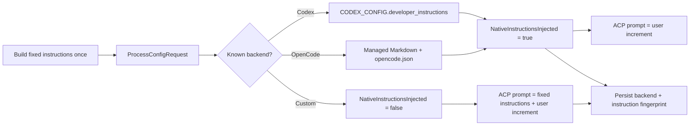

# ACP Native Instructions Design

## Goal

Stop sending MediaGo Drama's fixed Agent instructions as part of every ACP user
message while preserving behavior for Codex, OpenCode, and custom ACP backends.

## Requirements

### Functional

- Build the existing AGENTS, TOOLS, DOCUMENT_RULES, and Skill index locally to
  compute the current instruction identity; transmit it only when a process is
  launched or replaced.
- Inject that text through Codex and OpenCode native configuration.
- Send only `BuildACPUserPrompt` plus a recovery recap through ACP for bundled
  backends.
- Preserve the legacy inline prompt for an unsupported custom backend.
- Allow an operator to switch back to inline delivery without a code rollback.
- Rebuild a session when its instruction identity no longer matches.

### Non-functional

- No fixed instruction text may be logged as a `PromptRequest` for native mode.
- Existing Codex JSON configuration must not lose fields or numeric precision.
- Managed OpenCode instruction files and directories must use restrictive POSIX
  modes and preserve inherited Windows ACL behavior.
- An injection failure must stop before process startup; silently running without
  fixed rules is not allowed.
- The change must remain testable without launching a real model provider.

## Architecture

The ACP runner owns instruction rendering and the final decision about prompt
shape. The application wiring owns backend selection. Settings owns generated
OpenCode files. This keeps the backend-specific storage details out of the prompt
package and prevents the provider from deciding ACP message semantics.

## Data Flow

1. The runner normalizes the run request and renders fixed instructions.
2. It passes those instructions to `PrepareACPProcessConfig` before spawning the
   child process.
3. The provider applies native configuration for Codex/OpenCode and returns an
   explicit acknowledgement.
4. The runner computes a versioned SHA-256 fingerprint over delivery kind,
   backend ID, and instruction text.
5. A stored ACP session is resumed only when its fingerprint matches. Otherwise
   a new session is created and the existing transcript recap is prepended.
6. Native mode sends only the user increment; fallback mode preserves the current
   fixed-prefix format.
7. A successful run persists both ACP session ID and fingerprint.

## Backend Details

### Codex

Read `CODEX_CONFIG` from the prepared process environment, falling back to the
inherited environment. Decode it as `map[string]json.RawMessage`, reject malformed
or non-object JSON, replace only `developer_instructions`, and encode it back.
Using `RawMessage` preserves large integers and unknown nested configuration.

### OpenCode

Hash the logical rendered configuration plus instruction body, stage the complete
directory, and atomically publish it as `<ConfigRoot>/<sha256>`. Write the body to
`<ConfigDir>/instructions/mediago-drama.md` and add its final absolute path to the
generated config's `instructions` array. Instructions alone are enough to create
a managed config even when no MediaGo model profiles are enabled. Identical
content safely reuses a directory; different model/instruction variants never
share mutable files.

## Failure Handling

| Failure | Behavior |
|---|---|
| Invalid inherited `CODEX_CONFIG` | Return a configuration error before process startup |
| Native Codex config exceeds the Windows UTF-16 environment-entry limit | Return an actionable error recommending shorter instructions or `inline` rollback |
| OpenCode directory/file write fails | Return the wrapped filesystem error |
| Provider does not acknowledge injection | Use the tested inline compatibility path |
| Instruction fingerprint changes | Create a new ACP session and inject compact recap |
| Native mode is rolled back to inline | Fingerprint mismatch prevents mixed session state |

## Testing

- Runner unit tests prove native prompts exclude fixed markers and fallback
  prompts retain them.
- Process configuration tests prove the full fixed text reaches the provider.
- Codex merge tests cover field preservation, replacement, large integers, parent
  environment precedence, and invalid JSON.
- OpenCode tests cover profile and no-profile paths, absolute references, file
  contents, POSIX permissions, Windows compilation, immutable content addressing,
  concurrent publication, and no instruction-body duplication in JSON.
- Session service tests cover fingerprint persistence and clearing.
- ACP helper tests cover deterministic fingerprinting and mismatch invalidation.
- Run targeted package tests, then `go test ./...`, formatting, vet, and build.

## Deferred Work

- Replace the full workspace resource index with ResourceLink/embedded Resource
  blocks plus MCP discovery.
- Reduce the Skill index to a small router and load Skill bodies just in time.
- The per-MediaGo-session connection manager, cancellation fallback, idle
  eviction, crash recovery, and process fingerprints are implemented by the
  follow-up ADR-0003 design.
- Consider multi-session connection sharing only after callback routing is solved.
