# Agent 图片与视频生成确认收紧 Implementation Plan

> **For Claude:** REQUIRED SUB-SKILL: Use superpowers:executing-plans to implement this plan task-by-task.

**Goal:** 保证 Agent 每次新建图片/视频生成，都只能在用户确认了本次具体生成意图后执行；上下文缺失、请求篡改、重复调用和并发调用均不得绕过确认或重复创建供应商任务。

**Architecture:** 在现有 `generation_plan + generation_settings` 之上增加不可变 `GenerationPlanIntent`，把用户确认绑定到完整的单项或有序批次请求。Generation MCP 使用显式 caller mode；Agent mode 缺少 run context 时 fail closed。提交前对规范化请求做原子一次性 claim，成功/失败结果持久化用于幂等重放。Generation MCP 只公开单项与批量创建；任务查询、HTTP 重试能力、后台轮询和选片继续由工作台与后台服务承担。

**Tech Stack:** Go、MCP Go SDK、Gorm/SQLite、Gin、React 19、TypeScript、Vitest、Tailwind CSS v4。

---

## 已确认的产品语义

1. 一次确认授权一次单项生成，或一次完整批量生成；批量不按子项重复弹窗。
2. 用户确认的不只是模型参数，还包括 prompt、生成项数量与顺序、目标资源和参考资产。
3. 同一确认不能用于第二次真实生成；相同工具请求的技术重试只能拿到首次结果。
4. 已提交任务的后台供应商调用、轮询、缓存和完成通知不再次确认。
5. Agent 若要再次创建供应商任务或增加输出数量，必须创建新的 generation plan。
6. Agent mode 的 run/session/selection store 任一缺失均拒绝图片和视频，不允许自动降级。
7. 手动工作台与后台任务继续使用既有 HTTP/worker 边界；音频和文本不在本次改动范围。

对应架构决策见 `docs/adr/0001-intent-bound-agent-generation-authorization.md`。

## 验收矩阵

| 场景 | 预期 |
| --- | --- |
| Agent 单项图片/视频，缺少 run/session/store | 拒绝；不调用 generation service |
| Agent 单项图片/视频，无 selection 或 selection 非 submitted | 拒绝 |
| 历史 generation plan 没有 intent | 拒绝并要求重新确认 |
| selection 与完整单项请求一致 | 只创建一个任务 |
| 修改 prompt、kind、目标、参考图、路由或 params | 拒绝 |
| 同 selection + 同请求再次调用，首次已有结果 | 返回首次结果；任务数不增加 |
| 同 selection + 同请求并发调用 | 仅一个调用获得 claim |
| 同 selection + 不同请求 | 拒绝 |
| 完整批次与 intent 一致 | 一次 claim 后提交整个批次 |
| 增删、重排或替换任一批次子项 | 整批拒绝，不产生部分任务 |
| 后台 worker 继续已确认任务 | 不弹窗，正常完成 |
| 手动 HTTP 生成、任务查询、重试与选片 | 现有流程不变 |
| Agent 音频/文本 | 现有流程不变 |

## 非功能要求

- 原子性：任何可能调用供应商或创建任务的代码必须位于 claim 成功之后。
- 并发安全：至少 20 个并发相同请求只能创建一个任务或一个批次。
- Fail-safe：claim 后结果未知时不得自动重提，避免重复扣费。
- 性能：本地授权校验和 claim 的 p95 目标小于 20ms，不包含生成服务耗时。
- 数据限制：intent 使用版本化 JSON；1–50 项，item ID 唯一，序列化后不超过 1MiB。
- 隐私：日志只记录 selection ID、run ID、指纹与拒绝原因，不记录完整 prompt。
- 兼容：数据库字段全部为 additive；历史记录可读，但不再授权新的 Agent 图片/视频生成。

## 目标数据流

```mermaid
sequenceDiagram
    participant A as Agent
    participant D as Document MCP
    participant U as User
    participant G as Generation MCP
    participant S as Selection Store
    participant W as Generation Service

    A->>D: ask_user_form(settings + immutable intent)
    D->>S: persist pending selection
    D-->>U: show intent summary + editable settings
    U->>S: submit confirmed settings
    S-->>A: submitted selectionId
    A->>G: generate_media[_batch](selectionId, exact request)
    G->>S: validate + atomic claim(fingerprint)
    alt first use
        S-->>G: claimed
        G->>W: create task/batch
        W-->>G: accepted output
        G->>S: persist replayable outcome
        G-->>A: task/batch output
    else completed duplicate
        S-->>G: saved outcome
        G-->>A: replay original output
    else mismatch or uncertain
        S-->>G: deny
        G-->>A: typed authorization error
    end
```



## Task 1：扩展 MCP 协议，先锁定 schema

**Files:**

- Modify: `packages/mcp/pkg/mcp/selection_types.go`
- Modify: `packages/mcp/pkg/mcp/generation_types.go`
- Modify: `packages/mcp/pkg/mcp/tools.go`
- Modify: `packages/mcp/pkg/mcp/selection_test.go`
- Modify: `packages/mcp/pkg/mcp/mcp_test.go`
- Modify: `packages/mcp/internal/tools/generation/register.go`
- Modify: `packages/mcp/pkg/server/store.go`
- Modify: `packages/mcp/pkg/server/server_test.go`

**Step 1: 写失败的协议测试**

锁定以下 JSON 字段和描述：

- `AskUserFormInput.intent`：创建图片/视频时必填的 `GenerationPlanIntentInput`。
- `GenerationBatchInput.confirmationSelectionId`：批次级确认 ID。
- 工具描述明确“一次确认授权一次完整请求；批次 selection ID 位于批次级”。

**Step 2: 定义版本化 intent 类型**

最小协议形状：

```go
type GenerationPlanIntentInput struct {
    Version           int                             `json:"version"`
    Operation         string                          `json:"operation"`
    ConversationTitle string                          `json:"conversationTitle,omitempty"`
    Items             []GenerationPlanIntentItemInput `json:"items"`
}

type GenerationPlanIntentItemInput struct {
    ID                 string                        `json:"id"`
    Kind               string                        `json:"kind"`
    Prompt             string                        `json:"prompt"`
    AssetTitle         string                        `json:"assetTitle,omitempty"`
    CapabilityID       string                        `json:"capabilityId,omitempty"`
    ConversationID     string                        `json:"sessionId,omitempty"`
    ScopeID            string                        `json:"scopeId,omitempty"`
    DocumentID         string                        `json:"documentId,omitempty"`
    SectionID          string                        `json:"sectionId,omitempty"`
    DocumentContext    *GenerationDocumentContext    `json:"documentContext,omitempty"`
    ResourceType       string                        `json:"resourceType,omitempty"`
    ReferenceAssetIDs  []string                      `json:"referenceAssetIds,omitempty"`
    NotificationTarget *GenerationNotificationTarget `json:"notificationTarget,omitempty"`
}
```

`operation` 首版只允许 `create_single`、`create_batch`。协议不接受 route、params、
提示词包或优化设置进入 intent；这些只能来自用户提交的 `generation_settings`。

**Step 3: 更新 dispatcher 接口与注册**

Generation dispatcher 只保留 `generate_media` 与 `generate_media_batch`，分别接收单项和批次创建输入。运行：

```bash
cd packages/mcp
go test ./pkg/mcp ./internal/tools/generation ./pkg/server
```

预期：协议和注册测试通过。

## Task 2：持久化 intent 与一次性 claim 状态

**Files:**

- Modify: `services/server/internal/domain/workspace_models.go`
- Modify: `services/server/internal/repository/agent_selection_repo.go`
- Modify: `services/server/internal/repository/db.go`
- Modify: `services/server/internal/service/selection/types.go`
- Modify: `services/server/internal/service/selection/store.go`
- Modify: `services/server/internal/service/selection/store_test.go`
- Add/Modify: `services/server/internal/repository/agent_selection_repo_test.go`

**Step 1: 写持久化和并发失败测试**

覆盖：

- intent 创建、读取与 JSON 版本校验；
- 不同 intent 不得被 `FindReusable` 合并；
- 已 claim 的 generation selection 不得被新一次 ask 当作可复用授权；
- 20 个 goroutine 对同一 selection/fingerprint claim，只有一个返回 `claimed`；
- 相同指纹且已有 outcome 返回 `replay`；
- 相同指纹无 outcome 返回 `in_progress_or_unknown`；
- 不同指纹返回 `conflict`；
- 非 submitted、错误 project/session/run、过期 selection 均不能 claim。

**Step 2: 增加 additive 字段**

在 `AgentSelectionModel` 和 service `Record` 中加入：

```text
intent_json
generation_claim_fingerprint
generation_claimed_at
generation_outcome_json
generation_completed_at
```

`generation_outcome_json` 使用版本化 envelope，保存成功输出或稳定的失败信息；不得保存
密钥、请求头或供应商凭据。确认 AutoMigrate 覆盖新增列。

**Step 3: 增加 selection service API**

实现：

```go
ClaimGenerationUse(projectID, sessionID, runID, selectionID, fingerprint)
CompleteGenerationUse(projectID, selectionID, fingerprint, outcome)
```

repository 的 claim 必须是带条件的单条 UPDATE/CAS，不能依赖进程内 mutex；桌面端重启或
未来多进程接入时仍需正确。

`CompleteGenerationUse` 只允许当前 fingerprint 写入一次 outcome。claim 后调用失败也写入
失败 outcome；进程在两者之间崩溃时保留“结果未知”状态。

**Step 4: 把 intent 纳入复用指纹**

`FindReusable` 只可返回：

- 同 run、同表单、同 intent 的 pending selection；或
- 最近提交、尚未 claim 的同一 selection。

已经 claim/completed 的 selection 不得被下一次真实生成复用。

运行：

```bash
cd services/server
go test -race ./internal/repository ./internal/service/selection
```

## Task 3：在 selection 创建入口校验 intent

**Files:**

- Modify: `services/server/internal/app/mcp/selection.go`
- Modify: `services/server/internal/app/mcp/selection_test.go`
- Modify: `services/server/internal/service/selection/types.go`
- Modify: `services/server/internal/service/selection/store.go`
- Modify: `services/server/internal/service/selection/store_test.go`

**Step 1: 写非法 intent 测试**

拒绝：

- `generation_plan` 没有 intent；
- version 不是 1；
- kind 不是 image/video 或与 `generation_settings.kind` 不一致；
- 单项操作不是恰好 1 项；批次为空或超过 50 项；
- item ID 重复、prompt 为空或 operation 不是 create single/batch；
- intent 超过 1MiB；

**Step 2: 规范化后持久化**

trim 字符串、去重参考资产 ID，同时保留 batch item 顺序。project ID 不由 Agent 提供；
由当前 document MCP 上下文写入并在授权时再次核验。

**Step 3: 保留一般 selection 兼容性**

非 generation kind 的 ask 仍允许没有 intent。已有历史 selection 可读取；历史
`generation_plan` 只是在真正生成时返回 `GENERATION_CONFIRMATION_STALE`。

运行：

```bash
cd services/server
go test -race ./internal/app/mcp ./internal/service/selection
```

## Task 4：让用户看到被授权的具体内容

**Files:**

- Modify: `services/server/internal/service/agent/agent_svc.go`
- Modify: `services/server/internal/app/mcp/selection.go`
- Modify: `services/server/internal/app/mcp/selection_test.go`
- Modify: `apps/workspace/src/api/types/agent.ts`
- Add: `apps/workspace/src/domains/agent/components/timeline/AgentGenerationIntentSummary.tsx`
- Add: `apps/workspace/src/domains/agent/components/timeline/AgentGenerationIntentSummary.test.tsx`
- Modify: `apps/workspace/src/domains/agent/components/timeline/AgentFormCard.tsx`
- Modify: `apps/workspace/src/domains/agent/components/timeline/AgentFormCard.test.tsx`

**Step 1: 扩展 Agent form payload**

事件携带服务端已规范化的 intent，而不是依赖 Agent 自己写的 prompt 摘要。前端类型与
服务端 payload 使用同一版本字段。

**Step 2: 实现只读意图摘要**

在设置表单上方显示：

- 单项/批量与图片/视频类型；
- 总项数；
- 每项标题和 prompt 摘要；
- 目标文档/资源与固定参考图数量；
- 批次明细可展开，长 prompt 可展开查看完整内容。

不得提供局部修改 intent 的控件；用户需要修改时点击取消并在对话里说明。表单的模型、
参数、公共参考图、提示词包和优化开关仍可编辑。

**Step 3: 冻结态保留确认摘要**

提交后卡片必须显示“已确认 N 项 + 设置摘要”，历史 hydrate 后保持一致。取消和过期态也
保留原意图摘要，便于审计。

运行：

```bash
cd apps/workspace
pnpm test -- AgentGenerationIntentSummary AgentFormCard
pnpm lint
pnpm format
pnpm build
```

## Task 5：显式区分 Agent 与手动调用，关闭空 run 绕过

**Files:**

- Modify: `services/server/internal/app/mcp/generation_server.go`
- Modify: `services/server/internal/app/mcp/generation_confirmation.go`
- Modify: `services/server/internal/app/mcp/generation_confirmation_test.go`
- Modify: `services/server/internal/app/app.go`
- Modify: `services/server/internal/app/mcp_stdio.go`
- Add/Modify: `services/server/internal/app/app_test.go`

**Step 1: 写 fail-closed 测试**

在 Agent mode 下分别缺少 session ID、run ID、selection store、selection ID，断言图片和
视频 create/batch 都在 generation service 调用前失败。Generation MCP 不再公开任务查询、
重试、主动轮询或选片工具；音频与文本保持底层服务能力。

**Step 2: 引入显式 caller mode**

用枚举或不同构造器表达 `agent` 与 `trusted_manual`，删除
`runID == "" => skip confirmation` 的推断。生产 `/mcp/generation` HTTP factory 与 stdio
全部显式使用 Agent mode。

手动工作台走现有 Gin generation handlers，不依赖这个兼容分支。若保留 manual MCP
构造器，调用点必须在代码中显式命名并单独测试。

**Step 3: 返回稳定错误码**

至少区分：

```text
GENERATION_CONFIRMATION_CONTEXT_MISSING
GENERATION_CONFIRMATION_REQUIRED
GENERATION_CONFIRMATION_STALE
GENERATION_CONFIRMATION_MISMATCH
GENERATION_CONFIRMATION_CONSUMED
GENERATION_CONFIRMATION_OUTCOME_UNKNOWN
```

运行：

```bash
cd services/server
go test -race ./internal/app ./internal/app/mcp
```

## Task 6：绑定完整请求并实现一次性幂等提交

**Files:**

- Modify: `services/server/internal/app/mcp/generation_confirmation.go`
- Modify: `services/server/internal/app/mcp/generation_confirmation_test.go`
- Modify: `services/server/internal/app/mcp/generation.go`
- Modify: `services/server/internal/app/mcp/generation_test.go`
- Modify: `services/server/internal/app/mcp/generation_server.go`

**Step 1: 把校验拆为无副作用 prepare**

实现一个共同 prepare 流程：

1. 解析并校验 submitted selection 与 settings；
2. 解析 intent；
3. 规范化 MCP 输入的有效 project/session/scope/kind；
4. 合成预期请求：intent 固定字段 + 用户确认的 settings；
5. 深比较实际请求与预期请求；
6. 对规范化请求做 canonical JSON + SHA-256，排除 `confirmationSelectionId`；
7. 返回 prepared request 与 fingerprint，不触碰 generation service。

比较范围必须覆盖所有可能改变生成或写入目标的字段：prompt、assetTitle、capabilityId、
sessionId、documentId、sectionId、documentContext、resourceType、notificationTarget、routeId、params、
referenceAssetIds、promptSupplements、promptOptimization，以及 batch item ID/数量/顺序。

公共参考图与每项固定参考图按“规范化有序并集”形成该项预期值；前端必须在意图摘要中
同时展示固定参考图。`referenceUrls`、`referenceBindings` 与 family/version/provider/model
覆盖在 Agent create 中继续拒绝。

**Step 2: claim 后再进入副作用代码**

单项流程：

```text
prepare -> claim -> generation service -> persist outcome -> return
```

同指纹 replay 直接反序列化首次 `GenerationMessageOutput`。claim 无 outcome 时返回
`GENERATION_CONFIRMATION_OUTCOME_UNKNOWN`，绝不再次调用 service。

**Step 3: 保存成功和失败 outcome**

service 返回后，无论成功还是稳定失败都完成 outcome。错误 envelope 只保存可向 Agent
返回的 code/message/status，不保存内部堆栈或凭据。若保存 outcome 本身失败，向调用方返回
“结果未知”，同时保留 claim。

**Step 4: 写并发与篡改测试**

使用计数 fake service 覆盖：

- prompt/目标/通知/参考图/设置任一差异时调用次数为 0；
- 20 个并发相同单项请求调用次数为 1；
- 完成后重复请求输出完全相同；
- claim 后模拟进程窗口/保存失败不会二次调用；
- 同 selection 不同请求被拒绝。

运行：

```bash
cd services/server
go test -race ./internal/app/mcp
```

## Task 7：把批次作为一个原子授权单元

**Files:**

- Modify: `services/server/internal/app/mcp/generation.go`
- Modify: `services/server/internal/app/mcp/generation_test.go`
- Modify: `services/server/internal/app/mcp/generation_confirmation.go`
- Modify: `services/server/internal/app/mcp/generation_confirmation_test.go`
- Modify: `packages/mcp/pkg/mcp/generation_types.go`

**Step 1: 移除逐项授权语义**

Agent batch 只读取 `GenerationBatchInput.confirmationSelectionId`。子项中的旧字段继续可反序列
化以兼容历史调用，但 Agent mode 出现子项确认 ID 时拒绝，避免多个 selection 拼成未确认的
新批次。

**Step 2: 整批 prepare 和 claim**

先验证所有 item 与有序 intent 完全一致，再做一次 batch fingerprint 和一次 claim。任一项
不匹配时整批返回授权错误，不进入现有“单项 preflight error、其他项继续”的业务路径。

授权通过后，generation service 原有的供应商级 partial success 语义保持不变；首次完整
batch output 作为一个 outcome 保存并可重放。对失败子项再次生成必须创建新的确认。

**Step 3: 写批次测试**

覆盖 1、2、50 项，以及增项、减项、重排、重复 ID、替换 prompt、替换目标、并发重复和
首次 partial success 重放。

运行：

```bash
cd services/server
go test -race ./internal/app/mcp ./internal/service/generation
```

## Task 8：更新 Agent 指令与契约金丝雀

**Files:**

- Modify: `packages/instructions/pkg/official/assets/instructions/TOOLS.md`
- Modify: `packages/instructions/pkg/pack/builtin/assets/skills/image-generation.skill.md`
- Modify: `packages/instructions/pkg/pack/builtin/assets/skills/video-generation.skill.md`
- Modify: `packages/instructions/pkg/official/official_test.go`
- Modify: `packages/instructions/pkg/pack/builtin/builtin_test.go`
- Modify: `services/server/internal/service/prompt/testdata/*.golden`

**Step 1: 更新行为说明**

明确：

- ask form 时必须带完整 intent；
- 用户说“直接生成/不用问我”也不能跳过图片/视频确认；
- batch 使用一个批次级 selection ID；
- timeout 继续 await 同一 selection；
- 已接受图片/视频任务后结束当前 run，后台履约无需再确认。

Generation MCP 只列出 `generate_media` 与 `generate_media_batch`；模型目录由统一表单通过 HTTP
加载，任务查询、重试、后台轮询和选片由工作台与后台服务承接。

**Step 2: 加关键文案测试**

测试必须锁定 `intent`、`batch-level confirmationSelectionId`、`single use`、
`missing run fails closed` 和提交即结束，防止未来提示词回退。

运行：

```bash
cd packages/instructions
go test ./...

cd ../mcp
go test ./...
```

## Task 9：全链路验证、可观测性与发布

**Files:**

- Modify as needed: `services/server/internal/app/mcp/*.go`
- Modify as needed: `services/server/internal/platform/metrics/*`
- Add: `docs/plans/2026-07-16-agent-generation-confirmation-acceptance.md`

**Step 1: 增加不含 prompt 的审计日志/指标**

记录：

```text
agent_generation_authorization_claim_total
agent_generation_authorization_replay_total
agent_generation_authorization_denied_total{reason}
agent_generation_authorization_outcome_unknown_total
```

日志关联 selection ID、project/session/run、tool、fingerprint 前缀和 batch item count；不记录
完整 prompt、reference URL 或 provider credential。

**Step 2: 跑模块质量门**

```bash
cd packages/mcp
task check

cd ../instructions
task check

cd ../../services/server
task check

cd ../../apps/workspace
pnpm test
pnpm lint
pnpm format
pnpm build
```

所有命令必须通过；若失败，修根因后重跑，不用跳过测试或放宽校验。

**Step 3: 手工验收**

按验收矩阵至少验证：

- Agent 单图、单视频、2 项批量和 50 项批量；
- 取消、超时后继续等待、提交后再调用；
- prompt/目标/顺序篡改；
- 双击与两个并发 tool call；
- 服务端在 claim 后、outcome 前中断；
- HTTP 任务查询与重试能力、后台轮询、工作台选片链路仍可用；
- 手动批量弹窗、音频和文本底层能力回归；
- App 重启后 selection 与 outcome 仍能正确重放或拒绝。

结果写入 acceptance 文档，包含用例、期望、实际、task/batch 数量和截图链接。

## 发布顺序

1. 先发布 additive 数据列、协议读取能力和 UI intent 展示。
2. 同一桌面应用版本中启用新 intent 写入和批次级 confirmation ID。
3. 最后启用严格 enforcement；生产默认必须 strict，不保留可被运行时误开的 permissive 开关。
4. 对不含 intent 的历史确认返回清晰“确认已过期，请重新确认”，不做兼容放行。
5. 观察 deny/replay/outcome-unknown 指标；需要回滚时回滚整个应用版本，不回滚到空 run 放行。

## 风险与缓解

| 风险 | 缓解 |
| --- | --- |
| claim 成功但进程崩溃，无法确认供应商是否收到 | 保留 claim，拒绝自动重提；新确认后由用户决定 |
| 大批次 prompt 让确认卡过长 | 首屏显示数量和标题，明细按项展开；仍可查看完整 prompt |
| 历史 Agent 会话无法继续使用旧确认 | 返回 stale 错误并创建新表单；不牺牲授权边界 |
| Agent 重新 ask 时复用已消费 selection | `FindReusable` 排除 claimed/completed 记录 |
| batch 一项不匹配仍提交其他项 | 授权校验在 batch service 前整批完成 |
| outcome 持久化包含敏感信息 | 使用白名单 output envelope，日志与存储均不写凭据 |
| 手动生成被误伤 | caller mode 显式配置；Gin 手动接口独立回归测试 |

## 建议提交切分

1. `feat(mcp): add generation intent authorization contract`
2. `feat(selection): persist and atomically claim generation authorization`
3. `feat(agent): show immutable generation intent in confirmation cards`
4. `fix(generation): fail closed and bind agent requests to confirmation`
5. `fix(generation): authorize batches exactly once`
6. `docs(agent): lock generation confirmation instructions and acceptance`

实施时只暂存各提交涉及的明确文件，避免把当前工作区中的无关改动带入提交。
