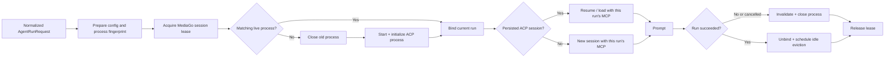

# Resident ACP Sessions Design

## Goal

Reuse a live ACP process and connection across consecutive turns in the same
MediaGo session without weakening callback isolation, cancellation safety, or
configuration freshness.

## Requirements

### Functional

- Start and initialize at most one live ACP process for each active MediaGo
  session.
- Reuse the already active ACP session on a successful consecutive turn.
- Start a replacement process when launch-affecting configuration changes.
- Resume/load the persisted ACP session after process replacement when supported.
- Discard the process after cancellation, prompt failure, or protocol failure.
- Evict successful idle processes and close all processes during runtime shutdown.
- Keep permission resolution and event publication scoped to the currently
  running MediaGo turn.
- Keep runtime-config inspection independent from conversation residency.

### Non-functional

- Different MediaGo sessions must not share a callback endpoint.
- The registry must be race-safe under concurrent turns, idle timers, process
  exits, and shutdown.
- Secrets may influence a process fingerprint but may not be logged or persisted.
- Waiting for the same session must count as an active lease so an idle timer
  cannot evict the process between queued turns.
- Existing ACP behavior and the inline-instruction compatibility path must remain
  testable without a real child process.

## Architecture

The runner owns a map keyed by MediaGo session ID. Each entry has a per-session
mutex, a resident process pointer, an active-or-waiting lease count, and an idle
timer. The global registry lock only protects map/timer bookkeeping; potentially
blocking ACP work happens under the entry mutex and never under the registry
lock.

The resident process contains the connection, its process-scoped callback
router, the initialize response, the launch fingerprint, and an idempotent close
function. A factory interface isolates OS process startup from runner behavior
and lets unit tests supply an in-memory fake connection.

## Process Identity

The versioned SHA-256 process fingerprint covers:

- ACP command and argument vector;
- absolute workspace and run directories;
- the sorted effective child environment, including provider-generated values;
- the current instruction fingerprint and native/inline delivery result;

Only the digest is retained. No environment value is logged. The
fingerprint intentionally excludes run ID, user prompt, and per-session config
selections because those are not child launch inputs. It also excludes MCP server
definitions: those contain per-turn run/document/selection context and belong to
session attachment, not process identity.

## Run-scoped MCP Attachment

MediaGo's document and generation MCP configurations currently embed `RunID`,
`ActiveDocumentID`, `SelectionText`, and `AgentTag` in an HTTP URL or stdio
environment. Reusing the process must therefore not mean prompting an already
attached ACP session directly. On every turn after the first, the runner calls
`session/resume` (preferred) or `session/load` with the current MCP definitions.
The ACP specification defines resume as reconnecting the requested MCP servers
without history replay. If attachment fails, the runner creates a fresh ACP
session and uses the compact recap path rather than continuing with stale tools.

## Run Binding

Each run keeps a fresh `acpClient` with its own publisher, IDs, raw logger,
message/thought buffers, metrics, and permission state. The process-scoped ACP
connection is attached to a synchronized `acpClientRouter`, which delegates
callbacks only to the currently bound run client. Stdout and stderr adapters
resolve the same current client at write time. Between runs they may emit process
diagnostics to the server logger, but they do not publish an event or append to
the previous run's raw log.

The active permission registry continues to expose the bound client only during
the run. Pending permission requests are cancelled before unbinding.

## Lifecycle and Failure Handling

1. Preparing configuration may fail before acquiring or mutating a resident
   process.
2. Acquiring increments the entry lease before waiting on its mutex and stops an
   existing idle timer.
3. A missing or mismatched process is closed and replaced.
4. A matching process still resumes/loads the persisted ACP session with this
   turn's MCP definitions. Only the process initialization is skipped.
5. The process is retained only after the entire run succeeds. Every error path
   closes and clears it before releasing the lease.
6. Release decrements the lease. A zero count schedules eviction; a later acquire
   stops the timer before waiting.
7. Unexpected connection completion clears only the exact process instance it
   observed, preventing an old watcher from deleting a replacement.
8. Runner shutdown marks the registry closed, stops timers, detaches resident
   processes, and closes each process exactly once. `AgentRuntime` invokes this
   after cancelling run contexts and before waiting for run goroutines, so a
   stuck transport cannot deadlock shutdown.

## Testing

- A fake process factory proves two successful turns in one MediaGo session use
  one process and one initialize/new-session sequence, while the second turn
  performs one resume with `run-2` MCP definitions before its prompt.
- A second MediaGo session proves callback/process isolation.
- Changed configuration fingerprints prove replacement and persisted-session
  resume/load behavior.
- Prompt error and cancelled context prove the next turn starts a new process.
- Idle timeout and explicit close prove deterministic process cleanup.
- Runtime tests prove `AgentRuntime.Close` invokes optional runner shutdown before
  waiting for active run goroutines and remains safe under concurrent calls.
- Race tests cover the ACP and Agent packages.

## Deferred Work

- Make the idle timeout an operator setting if production measurements require
  tuning.
- Gracefully retain a connection after a cancelled prompt only if the selected
  ACP adapters provide an explicit cancellation-complete acknowledgement.
- Consider cross-session multiplexing only after every client callback can be
  routed by ACP session ID and filesystem capability safety is demonstrated.
