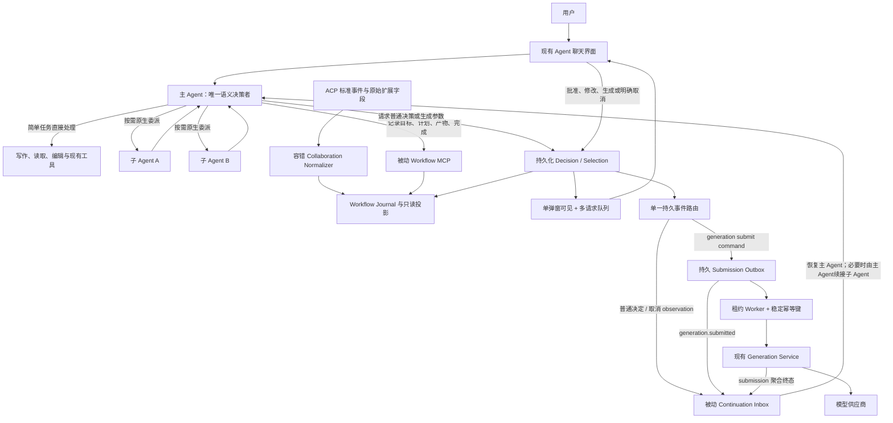

# 端到端主 Agent 编排与子 Agent 协作设计

**日期：** 2026-07-17  
**状态：** 已确认  
**范围：** 从用户创意、小说或现有项目材料出发，由主 Agent 识别目标、规划并执行，按需使用原生子 Agent，直到用户要求的产物边界；本设计不自动提交任何未经用户确认的图片或视频生成。

## 1. 结论摘要

本功能采用“Agent 主权、Runtime 被动”的架构：

- 主 Agent 是唯一的语义决策者。它识别用户目标、决定做到哪里、制定和修改计划、自己处理简单任务、按需创建子 Agent、决定并行度、汇总结果、处理失败并判断完成。
- Runtime 不实现业务调度器，不维护固定的小说→剧本→分镜→图片→视频流水线，也不决定何时创建子 Agent。它只负责执行 Agent 已明确表达的动作、持久化状态、投影事件、保证幂等、恢复等待并转交外部结果。
- 子 Agent 继续使用 Codex/ACP 原生协作能力。MediaGo 只观察并归一化已发生的协作事件，不代理 `spawn/wait/send/resume/close`，不引入限制 Agent 能力的自定义 dispatcher。
- 用户只要求剧本时，流程在剧本确认后结束；只要求分镜时，在分镜确认后结束；只有目标确实包含媒体产出时才进入图片或视频生成。
- 创意、剧本、分镜等重要里程碑使用普通决策请求。图片和视频的每一次真实生成尝试都必须打开项目现有的生成参数弹窗；用户在这个弹窗内提交即表示确认。
- 生成弹窗不增加积分、成本、付费或供应商扣费提示，不增加第二层确认，不实现收款或积分逻辑。
- 用户点击现有“生成”后，先持久同一 command 的 preparation receipt 与不可变 input pins，再由 FinalizeWithPins 原子写 selection decision 和 submission outbox；租约 worker 只在 finalize 后用稳定幂等键提交，崩溃恢复不盲目重提。
- 多个 Agent 可以分别等待用户决定。Workflow 仍保持 active，其他 Agent 可以继续运行；前端一次只展示一个弹窗，其余请求进入稳定队列。
- 子 Agent 在聊天时间线中只显示一个原地更新的状态胶囊。点击后可打开右侧详情 Sheet，Sheet 可关闭，不增加常驻仪表盘或第二套聊天界面。

相关决策记录：

- `docs/adr/0004-agent-sovereign-passive-runtime.md`
- `docs/adr/0005-observe-native-acp-collaboration.md`
- `docs/adr/0006-unified-checkpoints-and-generation-dialog.md`

## 2. 目标与非目标

### 2.1 目标

1. 主 Agent 能从自然语言识别实际目标和交付边界，而不是默认跑完全部短剧流程。
2. 主 Agent 能动态规划、直接执行简单任务，并自由选择是否委派给一个或多个子 Agent。
3. 子 Agent 的运行不阻塞整个 Workflow；其结果、等待和失败能可靠返回主 Agent。
4. 创意和内容里程碑能暂停对应工作，等待用户批准或修改意见后自动续接，无需用户重新发一条消息。
5. 图片或视频生成每次都经过现有生成参数弹窗，确认后的参数与实际提交参数严格一致。
6. 服务重启、SSE 断线、重复事件或生成任务长时间运行时，不丢失目标、Agent 状态、待确认请求和产物关联。
7. UI 维持现有聊天主界面复杂度，只增加按需出现的胶囊、弹窗和可关闭详情。

### 2.2 非目标

- 不实现固定阶段编排器、DAG scheduler、并发配额决策器或 Runtime 业务重试策略。
- 不让 Runtime 判断任务“简单还是复杂”，也不让 Runtime 决定是否创建子 Agent。
- 不自动生成图片或视频，不绕过现有生成弹窗。
- 不新增积分、计费、支付、余额校验或供应商积分同步。
- 不承诺 ACP 当前一定能暴露子线程全文、最终答案或直接恢复子线程；这些能力必须先由真实 fixture 证明。
- 不在首版增加常驻 Agent 管理页、并排多聊天窗口或不可关闭的右侧栏。

## 3. 用户目标决定流程边界

主 Agent 在开始工作时形成一个版本化 `GoalContract`。这是 Agent 对用户意图的解释，不是 Runtime 的固定流程定义。

```json
{
  "version": 1,
  "summary": "根据当前创意完成一版可拍摄剧本",
  "requestedDeliverables": ["idea_direction", "screenplay"],
  "excludedStages": ["storyboard", "image", "video", "final_edit"],
  "stopCondition": "screenplay_approved",
  "checkpointPolicy": {
    "idea": "confirm",
    "screenplay": "confirm"
  }
}
```

主 Agent 可以根据用户的新指令修订该契约。Runtime 仅保存版本和展示差异，不解释 `requestedDeliverables`，也不据此自动解锁下一阶段。

Runtime 只负责 Workflow 身份生命周期：会话没有 active Workflow 时分配一个空 envelope；已有 active Workflow 时，每条 root message 默认附着该 active Workflow。进入空 envelope 后，主 Agent 必须用 `record_goal(create)` 建立首个目标；继续当前目标用 `revise`；开始新的独立目标用 `replace` 提议显式终结/取代旧 Workflow 并处理其 pending requests。用户新消息是修订、追加还是替换目标，只由主 Agent声明；Runtime 不作语义猜测。已 terminal Workflow 后的下一项工作才会获得新的空 envelope。

`replace` 是一次作用域 handoff，不是在当前 Invocation 中热切换 Workflow。无论 ACP 是否能验证 caller，主 Agent的 replace 调用都先提交带稳定`commandId`的 proposal，并返回`proposedSuccessorWorkflowId + applied=false + restartRequired=false`；只有同一 root Invocation 的 strict final commit 才能应用。该事务以旧Workflow/goal version和`AgentSession.active_workflow_id`做CAS，终结旧Workflow、supersede其pending selections、discard未ack continuation，并用`oldWorkflowId + commandId`派生确定性的successor Workflow/rootTask/handoff/rootInvocation后切换session指针，同时持久旧root的最终答复。当前Invocation始终属于旧Workflow并结束。旧Run释放session lease后，Runtime才通过持久handoff以successor scope和原用户请求/交接摘要启动新的root Invocation；若在指针切换后崩溃，recovery用fence lease补启同一个successor Invocation，而不会创建第二个Workflow。replace与complete并发时，旧Workflow的同一版本CAS只允许一个获胜。

replace payload本身携带新目标的完整GoalContract；commit创建successor时直接写为goal version 1。successor root收到handoff后继续规划/执行，不能再次`record_goal(create|replace)`形成循环。只有真正的空envelope使用`create`；仍是同一目标时使用`revise`。旧root把replace proposal作为strict rootCommit最后一项并结束，不在旧scope继续执行新目标。

### 3.1 典型边界

| 用户目标             | 主 Agent 默认交付边界  | 默认重要节点                                  |
| -------------------- | ---------------------- | --------------------------------------------- |
| “帮我想一个短剧创意” | 创意方案               | 创意方向确认后结束                            |
| “只写剧本”           | 创意方向、剧本         | 创意确认、剧本确认；不进入分镜或媒体          |
| “做到分镜”           | 创意、剧本、分镜       | 创意、剧本、分镜分别确认后结束                |
| “从创意做到成片”     | Agent 动态规划完整链路 | 内容节点确认；每次图片/视频生成弹现有参数弹窗 |
| “把这段对白润色一下” | 润色后的文本           | 主 Agent 直接完成，通常无需子 Agent           |

创意节点是否需要确认仍由主 Agent结合用户明确指令判断。例如用户说“直接完成，不用中途问我”，Agent 可以跳过普通内容确认；图片和视频生成弹窗不能跳过。

## 4. 总体架构



### 4.1 权责边界

| 能力                           | 主 Agent                                     | 子 Agent          | Runtime                          |
| ------------------------------ | -------------------------------------------- | ----------------- | -------------------------------- |
| 识别目标和停止点               | 决定                                         | 提供建议          | 记录                             |
| 规划和重规划                   | 决定                                         | 可提出局部计划    | 保存快照                         |
| 简单任务直接执行               | 决定并执行                                   | 可执行被委派任务  | 提供工具                         |
| 创建、并行、继续、关闭子 Agent | 使用原生协作能力决定                         | 响应原生协作      | 只观察                           |
| 内容失败后的重试或改路         | 决定                                         | 可建议            | 报告事实                         |
| 用户确认                       | 请求并消费结果                               | 可经主 Agent 请求 | 持久化、排队、转交               |
| 图片/视频生成                  | 形成意图并请求弹窗；收到任务事实后决定下一步 | 可准备生成意图    | 用户点击生成后精确授权、幂等提交 |
| 判断 Goal 完成                 | 决定并调用 `complete_goal`                   | 只返回局部结果    | 标记并保存；不自动完成           |

## 5. 主 Agent 控制循环

主 Agent 的逻辑行为如下；这是一条指令原则，不是 Runtime 内的状态机代码：

```text
理解用户目标和明确排除项
→ 记录 GoalContract
→ 制定足够完成目标的动态计划
→ 对每个下一步自行判断：
   - 简单且适合当前上下文：主 Agent 直接执行
   - 可独立、耗时或需要专长：使用原生子 Agent
→ 汇总新事实和产物，必要时重规划
→ 到达普通内容里程碑时请求用户决定
→ 若需要图片/视频：为每一次实际生成打开现有生成参数弹窗
→ 只在用户目标的 stopCondition 达成后完成 Goal
```

主 Agent 不需要向 Runtime 申请“委派资格”。Runtime 也不能通过任务类型、阶段、深度、并发数或固定角色表限制 Agent 的协作能力。

## 6. 被动 Workflow 账本

### 6.1 核心对象

首版新增一组通用持久化投影，复用现有 `AgentSelection` 作为决定的权威记录，并为媒体副作用新增持久 submission outbox。逻辑任务和一次原生执行必须分开，原生执行一旦进入终态就不能回退成 waiting：

#### AgentWorkflow

- `id`, `project_id`, `session_id`, `root_task_id`
- `status`: `active | completed | failed | cancelled`
- `goal_json`: 最新 `GoalContract`
- `plan_json`: 最新 Agent 计划快照
- `goal_version`, `plan_version`
- `created_at`, `updated_at`, `completed_at`

`AgentSession.active_workflow_id` 作为可空指针并用 CAS 更新，保证同一 session 最多一个非终态 Workflow；不用“查询最新 active”来模拟唯一性。Workflow terminal/replace 事务原子清空或切换该指针。

Workflow 进入终态时不得留下非终态 AgentTask。`complete_goal` 的事务前置条件是 root Task 与所有 child Task 已经 terminal；主 Agent可以在同一个严格 root-final envelope 中先按顺序提交所需的 `record_task_outcome`，最后再提交 `complete_goal`。若仍有 `running | waiting_* | needs_attention` Task，整个 commit 拒绝，而不是由 Runtime 猜测结果。显式用户取消和 `record_goal(replace)` 属于作用域终止：其已验证事务可以把旧 Workflow 内仍非终态的 Task 统一投影为 `cancelled`，分别记录 `workflow_cancelled` 或 `workflow_replaced`，但不能把原生 Invocation 事实改写为成功。因而任何 terminal Workflow 的 Task 投影也全部 terminal。

#### AgentRootProposal

- `id`, `workflow_id`, `command_id`, `action`, `payload_json`
- `origin_root_invocation_id`, `proposer_task_id`, `proposer_invocation_id`
- `expected_goal_version`, `expected_plan_version`, `expected_task_revision`
- `status`: `pending | committed | discarded`
- `proposed_at`, `committed_at`, `discarded_at`, `discard_reason`

当ACP/MCP边界无法证明调用者是root时，所有root专属语义写入先成为不可变proposal。即使caller可验证，`complete_goal`、`record_goal(replace)`以及目标为`root_task_id`的`record_task_outcome`也始终成为proposal，保证scope/root终态与durable final答复原子提交；verified create/revise、plan和child Task outcome仍可直接应用。相同`workflow_id + command_id`只产生一条；payload不同则返回冲突。Runtime从authenticated run scope写入`origin_root_invocation_id`，child无法自报。proposal只能被同origin root Invocation的严格final envelope提交；该final没有选中的同轮proposal、terminal/replace后未提交proposal统一discard。

proposal 创建事务必须先锁定其 authenticated origin root Invocation，只允许 `root_final_challenge_status=pending` 时插入。challenge hash在seal时才签发，预建/原prompt期间可为空，因此无需跨进程保存明文。原 prompt 结束后，runner 在一个短事务内把 Invocation 从 `pending` CAS 为 `finalizing`，持久 challenge/seal token hash、sealed time 与当时全部 pending proposal 的稳定 snapshot hash；事务提交后才允许开始异步 finalization prompt，不能跨 ACP 调用持有数据库锁。只有持有seal token明文且仍持匹配root-run/session lease的runner可把同一Invocation从`finalizing`变成committed/rejected；双runner只有一个能seal。与seal、commit、reject或expire并发时使用同一锁序，一旦状态不是pending，迟到proposal返回`ROOT_INVOCATION_SEALED`且不创建记录。recovery只有在匹配root-run/session lease已过期/不存在且`sealed_at + finalization_timeout < now`时，才把stale finalizing原子变为rejected、discard snapshot proposals、重算Task并写恢复observation；活跃runner续租期间不得被后台scan误杀。

#### AgentRootFinalDelivery

- `id`, `workflow_id`, `root_task_id`, `root_invocation_id`, `root_run_id`
- `message_event_id`, `run_completed_event_id`, `event_bundle_json`, `bundle_fingerprint`
- `phase=pending|journaled|published|failed`, `revision`, `failure_code`, `jsonl_first_sequence`, `jsonl_last_sequence`
- `lease_owner`, `lease_until`, `lease_token`, `attempt`, `last_error`, `next_attempt_at`
- `created_at`, `journaled_at`, `published_at`

每个root Invocation至多一条，以root Invocation派生稳定ID。zero-proposal expire或strict semantic commit的同一SQLite事务必须保存已经验证的有序event bundle（先assistant message completed，再root run completed）、两个稳定event ID，并把root Invocation投影为completed、在session上设置`pending_final_delivery_id`；不保存challenge/seal明文，也不在数据库事务内写filesystem JSONL。

publisher用有期lease/fence claim。它通过ChatStore唯一的per-session writer/file lock执行`repair-and-append-once`：先flush并检查尾部；完整JSON缺换行则补换行，非法partial tail只截断到最后一个完整换行，非尾部损坏则fail closed；再按稳定event ID扫描，相同ID+相同canonical fingerprint复用原sequence，不同payload冲突；不存在才分配连续sequence、逐条完整append、flush并`fsync`文件（首次建文件还sync目录）。修复/失败后丢弃内存writer与sequence/read caches并重开扫描，持久化失败绝不live fanout。完整bundle落盘且sync后CAS为`journaled`，再用保留原sequence的`FanoutPersistedEvent`发布SSE，最后CAS `published`并清除匹配的session barrier。fanout不得再次append或把sequence清零。

SSE wire明确是at-least-once：fanout成功但`published` CAS前崩溃时，recovery可以再次fanout同一event ID/sequence。每条新持久AgentEvent带服务端计算的`payloadFingerprint=SHA-256(domain-v1 + canonical JSON(immutable semantic event))`；event ID和全部语义字段属于输入，sequence、payloadFingerprint本身及fanout/transport临时字段明确排除，赋sequence前后fingerprint不变。JSONL、hydrate和SSE原样携带该值，publisher/frontend只比较服务端字段，TypeScript不得重算或信任客户端自报。Event Broker不得改sequence或再次落盘；hydrate、前端stream ingest和store统一以`eventId + sequence`去重，并校验fingerprint，相同重放不产生第二条可见消息；同ID/sequence不同payload、同ID不同sequence或同sequence不同ID都fail closed。前端由hydrate播种并有界保存最近identity，legacy无fingerprint事件只保留sequence兼容；RootFinalDelivery新bundle不允许缺fingerprint。DB commit→append、JSON中途torn write、完整JSON→换行、fsync→journaled CAS、fanout→published CAS任一崩溃点都由同一ID修复/重放；承诺的是JSONL append once与visible projection once，不宣称物理SSE frame exactly once。任何新root/continuation/handoff在跨ACP或发session activity前都必须等待更早的`pending_final_delivery_id`达到published；磁盘冲突/非尾部损坏使delivery进入failed并保持barrier，不能让successor事件越过predecessor final。

`AgentRootFinalDelivery=failed`不回退已completed的root Task，而是派生session-scoped `rootFinalDeliveryRecovery`摘要：只含delivery ID/revision、稳定error code、queued input count和`canReconcile`，不含final正文。普通I/O错误保持pending/backoff；failed只用于same-ID/different-payload、非尾部损坏等完整性问题。project/session-scoped `ReconcileFailedRootFinalDelivery`带command ID与expected revision，只在用户或运维已经修复底层日志后重新执行完整只读校验/尾部安全修复：若稳定bundle已匹配或现可安全append，则以fence CAS恢复journaled/pending并继续原publisher；仍有非尾部损坏/冲突就保持failed，绝不截断中间历史或跳过final。前端现有任务区显示一条needs-attention和可关闭Sheet，可“重新检查”；若无法修复，只提供现有“新建会话”安全出口，不迁移、重发或伪完成旧session的queued inputs。

#### AgentWorkflowHandoff

- `id`, `predecessor_workflow_id`, `successor_workflow_id`, `replace_command_id`, `proposal_id`
- `predecessor_final_delivery_id`, `user_message_id`, `handoff_summary_json`
- `successor_root_task_id`, `successor_invocation_id`, `successor_run_id`, `target_acp_session_id`
- `dispatch_message_id`, `dispatch_fingerprint`, `recovery_capability`
- `status=pending|leased|sending|started|unknown|failed_definite|cancelled`, `revision`
- `lease_mode=dispatch|reconcile_only`, `lease_owner`, `lease_until`, `lease_token`
- `technical_attempt_count`, `send_started_at`, `remote_message_id`, `remote_correlation`
- `last_error`, `next_attempt_at`, `created_at`, `started_at`, `unknown_at`, `failed_at`

replace commit事务同时插入唯一pending handoff、确定性pending successor root Invocation和预分配run ID；本地Workflow/Task/Invocation/Run identity exactly-once，但ACP Prompt执行只有在fixture证明message ID lookup、definitely-absent判定、duplicate suppression与result replay后才可effectively-once。`dispatch_message_id`只在contract证明前作为correlation，不能假设ACP会去重。

handoff worker用owner+递增token claim；`leased`过期可以重领dispatch。跨ACP前的最终短事务必须同时验证predecessor final delivery已published且session barrier已清、旧root-run持久lease已释放、session pointer仍指向successor、Task/Invocation/run ID匹配，然后写`sending/send_started_at/dispatch fingerprint`并取得successor root-run lease；DB锁不跨ACP。`sending`后Prompt、instructions、handoff summary、target ACP session和所有identity均不可改变，也禁用现有empty-response新session重发。

`sending`租约过期只能`reconcile_only`：fixture-proven lookup found→started；权威definitely absent→重置pending并保留相同identity（root-final challenge仍在seal时才签发）；unsupported/inconclusive→unknown。unknown不自动重发、不清理current invocation、不启动第二个root，持续阻塞queued dispatch并以needs-attention让用户显式恢复/停止等待。`ReconcileUnknownHandoff`只重复fixture-proven lookup，绝不发送Prompt；found/definitely-absent按上述规则收敛，仍不确定就保持unknown。`CancelUnknownHandoff`以CAS将unknown置cancelled、bump fence、释放本地barrier并把successor root Task置needs_attention/清理current绑定，但不自动把原handoff Prompt重排或重发；barrier后已有queued inputs可继续，用户若要重做必须再给出明确新指令。迟到remote update只记审计事实，不能恢复已cancelled handoff的语义。`failed_definite`只表示已证明未跨ACP边界的永久错误；可重试pre-send错误保留pending/backoff。started后的进程中断走普通Invocation recovery，不能复用handoff再发Prompt。

异常恢复API全部绑定`project + session + handoff`：GET只返回当前unknown摘要、recovery capability和queued count；POST reconcile/cancel用command ID幂等并校验当前revision/fence，跨项目/会话、非unknown、旧revision或重复payload冲突均不能改变状态。reconcile lookup可以按用户新点击重复执行但每次调用仍有稳定command ID；cancel重放返回相同结果。该API不暴露Prompt正文、credential或ACP内部session token。

#### AgentQueuedInput

- `id`, `project_id`, `session_id`, `accepted_workflow_id`, `dispatch_workflow_id`, `user_message_event_id`
- `user_display_event_json`, `display_fingerprint`, `display_phase=pending|journaled`
- `blocked_by_final_delivery_id`, `blocked_by_handoff_id`, `status=pending|leased|dispatched|cancelled`
- `lease_owner`, `lease_until`, `lease_token`, `accepted_at`, `dispatched_at`

pending RootFinalDelivery与pending/leased/sending/unknown handoff都是session输入barrier。barrier期间到达的新用户消息先在SQLite持久`AgentQueuedInput`和稳定display payload并返回“已排队”；客户端可乐观显示，但在predecessor final published前不把该用户事件append进chat JSONL或权威SSE。final publisher清除barrier后，同一session append coordinator先按accepted order把这些user events journal+fanout，再允许successor accepted/started activity，因此顺序固定为`predecessor message.completed < predecessor run.completed < queued user events < successor accepted/started`。它不创建第二个root Invocation、不抢占预建handoff。`accepted_workflow_id`只用于审计，不是最终路由权限。

handoff unknown时queued inputs保持在显式recovery barrier后，不自动启动另一Invocation；用户触发只读reconcile得到found/definitely-absent，或显式停止等待后才解除相应barrier。停止等待不重排原handoff Prompt。handoff started且该root Run及其RootFinalDelivery barrier结束后，queued inputs才按accepted order逐条语义dispatch。

每条 queued input 在语义dispatch前重新读取 `AgentSession.active_workflow_id`与final/handoff barrier：若当前有新的pending/sending/unknown handoff则原序更新`blocked_by_handoff_id`并停止；若active Workflow已terminal/为空，则先CAS分配新的空envelope；否则把当次`dispatch_workflow_id`绑定到最新active Workflow。前一条输入导致二次replace/complete时，后一条绝不投递到旧terminal scope，也不静默discard。Runtime只保证消息不丢和串行边界，不合并内容或判断revise/replace。

只有`failed_definite`且已证明Prompt未跨ACP边界时，失败事务才可安全迁移原请求：它把successor Task置`needs_attention`，按expected current invocation清理预建绑定，把handoff原user message ref转成队首recovery `AgentQueuedInput`并解除failed barrier。`unknown`绝不走这条自动重建路径。只要session仍有pending queued input，后续新消息继续入队；明确失败恢复、服务重启或用户紧接着发消息都不会丢accepted输入或越序。

#### AgentTask

- `id`, `workflow_id`, `parent_task_id`
- `role`: `root | child`
- `name`, `task`, `status`, `current_action`, `revision`
- `status`: `pending | running | waiting_user | waiting_agent | waiting_external | needs_attention | completed | failed | cancelled`
- `current_invocation_id`
- `last_invocation_status`, `last_error_code`
- `started_at`, `updated_at`, `completed_at`
- `metadata_json`

一个 AgentTask 是用户可理解的持续工作单元，可以跨越初次执行、用户确认和后续 continuation。

#### AgentInvocation

- `id`, `workflow_id`, `task_id`, `parent_invocation_id`
- `native_session_id`, `native_thread_id`, `native_tool_call_id`
- `status`: `pending | running | completed | failed | cancelled | interrupted`
- root Invocation 可带 `root_final_challenge_hash`、`root_final_challenge_status=pending|finalizing|committed|rejected|expired`、`root_final_seal_token_hash`、`root_final_proposal_snapshot_hash`、`root_finalization_sealed_at`、`root_final_challenge_consumed_at`
- `started_at`, `updated_at`, `completed_at`
- `metadata_json`

AgentInvocation 表示一次 ACP/native execution。它的状态单调前进；若一个子 Agent 返回“需要用户决定”后结束，本次 Invocation 正常进入终态，而对应 AgentTask 进入 `waiting_user`。用户决定后的恢复、追加或重新委派会创建新的 Invocation，并继续关联同一个 Task。Invocation 失败只是一个事实，不能自动把逻辑 Task 标成 `failed`；Task 进入可恢复的 `needs_attention`，保存 `last_invocation_status/last_error_code`并清空 current invocation。主 Agent 再决定重试、换路、接管或显式终结。新的 retry/follow-up 在同一 Task 下创建新 Invocation。

Task 更新用 `expected revision` CAS。Invocation 终态只有在 `task.current_invocation_id == finishingInvocationId` 时才能更改 Task；旧 Invocation A 在新 Invocation B 已 running 后才到的失败只更新 A 的历史，不清空 B。AgentTask 的 `completed | failed | cancelled` 只能来自通过 RootAuthorityGate 的 `record_task_outcome(expectedTaskRevision)` 或已验证 root result，不由任意单次 Invocation 终态自动推导。Terminal Task 不能被新或迟到 Invocation 重开。

`complete_goal` 只能在同一事务看见所有 Task 已 terminal 时应用；若 root-final envelope 同时带 Task outcome proposals，则先预检全部 revision、按序应用 Task outcomes、最后应用 complete。replace/显式 Workflow cancel 的 bulk cancellation 是这一规则唯一的作用域终止投影，必须逐 Task 记录稳定 reason，迟到 Invocation 仍只追加历史事实。

#### AgentArtifact

- `id`, `workflow_id`, `producer_task_id`
- `version`: Artifact 自身的单调版本，用于决定绑定和 CAS
- `kind`: `idea | screenplay | storyboard | character | scene | image | video | other`
- `ref_type`, `ref_id`, `ref_version`
- `status`: `draft | awaiting_confirmation | approved | rejected | generating | completed | failed`
- `title`, `summary`, `metadata_json`

Artifact 只链接项目文档、生成任务和媒体资产，不复制这些系统的正文或二进制数据。消费方定义 `ArtifactRefResolver.CurrentVersion(projectId, refType, refId)`，从项目文档或媒体资产的权威 store 读取当前版本及稳定 fingerprint；不能信任 Agent 或 selection 自报的 ref version。Decide/生成副作用使用 `WithStableVersion(...)` 取得同一权威快照，并在该资源的 mutation guard 内完成 selection/outbox 事务，避免“校验后、提交前”被直接编辑的 TOCTOU；所有实现统一先按规范化 ref key 取 guard，再开 DB 写事务，禁止反向锁序。

#### AgentWorkflowEvent

- 单调序号、事件 ID、Workflow/Task/Invocation 关联、事件类型、版本化 payload
- `idempotency_key` 防止重放产生重复投影或重复 wakeup
- 对需要恢复 Agent 的 observation 记录稳定 `delivery_id/resume_token`、`delivery_status=pending|leased|delivered|acked|discarded`、`lease_owner/lease_until/lease_token`、`attempt/last_error/next_attempt_at`、`delivered_at/acked_at/discarded_at/discard_reason`
- 作为恢复和审计日志，不作为业务调度队列

Continuation 是带稳定 delivery ID 的至少一次交付，不伪称跨 ACP 边界 exactly-once。每次租约递增 fence token，所有状态转移按 owner + token CAS；过期可重投同一 delivery，旧 worker 不得跨 ACP 边界。在创建 root continuation Invocation 前的最终事务 CAS 同时验证 Workflow active、`session.active_workflow_id` 匹配与当前 lease token。Runner accepted/start 只把事件标为 `delivered` 并续租；只有 continuation Invocation 成功到达可持久 terminal result/回写 `agent.continuation.acked` 后才 `acked`。Terminal/replace 事务把所有未 ack 交付标为 `discarded`；已跨边界的迟到 Invocation 只能记录事实，对 terminal Workflow 的所有语义写入都被拒绝。所有已发生的部分写入依靠稳定 commandId 去重。

#### AgentSelection（复用并扩展）

新增 `session_id`、`workflow_id`、`requester_task_id`、`source_invocation_id`、`relay_task_id`、`decision_kind`、`artifact_id`、`artifact_version`、`artifact_ref_version`、`artifact_ref_fingerprint`、`resume_token`、`retention_mode`、`submission_owner`、nullable `generation_preparation_id`、`superseded_reason`、`superseded_by_version`、`superseded_at` 等关联字段。selection 创建时通过 `ArtifactRefResolver` 冻结外部 ref 快照；generation intent 中每个默认 input ref 也必须保存服务端解析的 authoritative version/fingerprint/hash，不能只保存一组 live `referenceAssetIds`。现有生成弹窗仍可增删参考素材，因此最终有序 refs 以用户提交的 `generation_settings.referenceAssetIds` 为准，intent 只提供默认值/约束；UI 在展示或选择每个资产时从服务端资产列表取得 opaque authoritative snapshot token，并在点击时随 ID/ordinal 一起提交。服务端不信任 token 内容，只用它与当前权威 version/fingerprint/hash 比较；缺 token、token 不属于该项目或已变化都 fail closed。这样新增引用也绑定到用户实际看到的版本，而不是点击瞬间的“当前 ID”。

pending 列表 reconcile 对 Artifact 和 intent 默认 refs 使用 `CurrentVersion`；Decide 和 generation Unit of Work 对用户最终提交的全部规范化 ref key 使用 `WithStableVersion` 原子守护。任一已展示 ref 在弹窗打开/选择后、用户点击前被替换或删除，selection 都原子变为 `superseded`，provider 调用为 0；不能悄悄把用户看到的旧输入换成同 ID 的新内容。即使用户直接编辑了项目文档而 Agent 没有再次 `publish_artifact`，旧 selection 也会先变为 `superseded`，不能被批准或提交。普通决定继续使用现有选项/表单；媒体决定继续使用现有 `generation_plan`、不可变 intent、参数指纹和单次 claim。

最终 ref token 由持久 `AgentSelectionInputSnapshot` 支撑：服务端在带 selection scope 的媒体资产列表/批量 snapshot endpoint 中，为用户实际看到或选中的 asset 生成随机 opaque token，只把 token hash、selection/ref scope、authoritative version/fingerprint/content hash 与 expiry 落库，前端看不到 raw hash。生成按钮在全部选中 refs 都拿到 token 前不可提交。点击 payload 使用独立 `referenceBindings[{id, ordinal, snapshotToken}]` 与 settings 中的 ordered IDs 一一对应；UoW 校验 token hash/scope/expiry，再在 mutation guard 内复核当前权威快照。刷新可签发新 token但不使其他未过期 token失效；Workflow/selection 终结时一并清理。升级前缺少可信 ref snapshot 的 pending generation selection 必须 supersede 并重新确认，不能在点击时补取当前内容。

generation的`semantic_command_fingerprint`只覆盖selection绑定的operation/intent版本、canonical generation settings以及最终ordered ref `id + ordinal`；明确排除随机`snapshotToken`、客户端request/command ID、时间和其他transport/UI字段。首次`BeginPreparation`必须先验证当次tokens，并把解析后的authoritative ref version/fingerprint/content hash写入frozen authorized plan及独立plan fingerprint。已有submission/preparation的lookup只比较semantic fingerprint并返回首次已授权结果，不重新校验新token；因此同refs/settings但刷新或第二tab取得不同有效token仍命中同receipt，改变ref ID/ordinal/settings则conflict。token过期只会阻止尚不存在receipt的首次Begin，不能使已授权receipt重放失败。

`submission_owner=none|agent_mcp|runtime` 创建后不可更改，创建白名单只有四种：`workflow + non-generation + none`走durable continuation；`workflow + generation_plan + runtime`走deferred confirmation/submission；`ephemeral + generation_plan + agent_mcp`走仍存活的原tool waiter；`ephemeral + non-generation + none`保留legacy waiter/run guard。除迁移读取兼容外，`ephemeral+runtime`、`workflow+agent_mcp`、generation+none、non-generation+runtime/agent_mcp一律拒绝，避免无接收者或双接收者。legacy blocking不承诺跨Run/重启保留。升级时旧 NULL/空 `retention_mode` 规范为 `ephemeral`，旧 generation_plan 的空 owner 规范/回填为 `agent_mcp`，其他旧 selection 为 `none`；新写入使用非空默认并保留读取时兼容规范化。两种 generation owner 在用户点击现有生成按钮时都进入同一个 `DecideGenerationWithSubmission` UoW 并立即持久 outbox；任何后续 `generate_media(_batch)` 只查询/返回已持久 outcome，不能创建 command。

`retention_mode=workflow` 的请求不受 source Invocation 或根 Run 终态影响，`Decide` 也不再用原 Run 是否仍活动作为有效性条件。它不沿用现有 30 分钟 `RetrieveTTL`：首版 `workflowDecisionRetention` 默认 7 天、可配置，并在创建时持久绝对 `expires_at`，因此重启不会重算。它只在用户明确决定、Agent 显式 supersede、Artifact 版本变更、Task/Workflow 终止或该独立 deadline 到达时终结；ephemeral selection 继续沿用现有 TTL。

所有关联AgentTask的selection终态都经过一个`SelectionOutcomeUoW`。workflow普通内容的`approved|revise|rejected|cancelled|superseded|expired|failed`各写一条由selection ID和终态稳定派生的`decision.*` event/delivery；runtime generation在submission建立前的`cancelled|superseded|expired|failed`各写一条`generation.confirmation.*`，而成功建立submission只写`generation.submitted`，不再写通用decision outcome。ephemeral agent_mcp同样在UoW内持久终态并重算Task，但不建continuation；commit后原waiter或重连的await按selection ID读取同一terminal result。selection终态、可选唯一delivery与requester Task事实投影在同一事务；deadline worker和pending-list reconcile都调用该UoW。若selection已关联`preparing|pins_ready` preparation，任何cancel/expiry/Artifact supersede/validation failure/Task terminal/Workflow cancel或replace事务必须按固定锁序同时把receipt置`failed(scope_terminal|selection_terminal)`、递增fence并清空lease，使旧materializer/finalizer迟到CAS失败；已经finalized则只按submission归档规则处理。若scope已terminal，只清理receipt/selection并discard delivery，不新建continuation；若另一个终态已先持久，失败恢复不得创建第二条SelectionOutcome。没有AgentTask关联的纯legacy ephemeral请求才保留旧路径。

Task非终态显示状态由同一个事务内事实聚合器重算，事件不能直接覆盖状态。`actionable pending selection`明确排除已关联`preparing|pins_ready` receipt的generation selection；这些selection仍是权威记录，但用户已点击，不可再次弹窗决定。优先级固定为：若active current Invocation存在且它自己仍有actionable pending selection，则`waiting_user`；否则active current→`running`；无active current但任一actionable pending selection→`waiting_user`；否则active generation preparation或nonterminal generation submission→`waiting_external`；否则若最后一个current执行失败/取消/中断且尚无replacement→`needs_attention`；其余→`waiting_agent`。每次selection create/terminal、preparation begin/terminal、submission create/terminal、Invocation bind/terminal都用expected Task revision CAS重算。这样source A创建确认时正确waiting_user；用户点击后blocking owner的active Invocation回running，deferred且无active current时进入waiting_external；页面重载不会再次弹同一确认；一个Task的第一个确认终结而同source还有第二个actionable pending时仍waiting_user；新Invocation B绑定后旧A pending不会压过B的running；B自己再请求确认时又会waiting_user，确认与媒体并存也按同一优先级收敛。

`record_task_outcome`把单个Task置terminal时，在同一事务把该requester Task的全部pending selections置`superseded`并写`superseded_reason=task_terminal`，同时discard关联Task所有未ack continuation deliveries（包括`decision.*`、`generation.confirmation.*`与`generation.submitted`）。不新增`task_terminal` selection status。已建立generation submission只继续外部对账/Artifact归档，不被伪取消；之后aggregate terminal只归档且不能重开或唤醒terminal Task。Task outcome与Decide共锁Task/selection：只能是outcome先赢后Decide拒绝，或Decide先赢且事实已持久，绝不让terminal Task留下pending modal。

#### AgentGenerationSubmission

- `generation_submissions` 的唯一约束只是 `project_id + selection_id`；服务端计算的 `command_fingerprint` 是该 selection 的不可变冲突守卫，不做全局唯一，不同 selection 允许相同 fingerprint。表中保存 Workflow/Artifact/retry lineage、operation、确定性 submission/batch ID、`pending | dispatching | submitted | completed | failed | partial | cancelled | unknown` 总体状态和 outcome。
- `generation_submission_items` 以 `submission_id + item_index` 唯一，按原顺序保存 intent item ID 和总体结果。每个 item 有一到两个有序 `generation_submission_steps`：普通“生成”只有 `generate_media`；现有“优化并生成”先有 `optimize_prompt`，再有 `generate_media`。step 以 `item_id + step_index` 唯一，保存类型、不可变 exact request 或 media template JSON/fingerprint、冻结的 `route_spec_json/route_spec_fingerprint/adapter_contract_version`、确定性 local task ID 和持久 provider idempotency key。
- item rollup status 为 `pending | running | completed | failed | cancelled | unknown`；step status 为 `blocked | ready | leased | sending | accepted | completed | failed_definite | cancelled | unknown`，并保存 `lease_mode=dispatch|reconcile_only`、`lease_owner/lease_until/lease_token/technical_attempt_count/send_started_at/provider_task_id/last_error`。所有转换都用 owner + 单调 fence token CAS。`ready` 或 expired `leased` 可由 dispatch worker 领取；expired `sending` 只能由一个 fenced reconcile-only worker 接管，绝不能再次 Generate。旧 worker 的任何迟到 response CAS 必须失败。批次必须先一次性持久全部有序 items/steps/task IDs，再有界并发 dispatch。
- 用户决定、Artifact/ref version CAS 校验、server-authoritative builder 产生的用户授权快照、generating Artifact/task 绑定、唯一 `generation.submitted` event 与 outbox 写入在同一数据库 Unit of Work 内完成。普通生成在此冻结 media exact request；“优化并生成”在此冻结 optimization exact request 与 media request template，并预留两个 step 的 deterministic task/provider identity。每个 step 同时冻结已解析 route 的 kind/adapter/provider/model/参数 schema与 limits fingerprint，以及 adapter contract version。优化结果成功后，单一 CAS 事务先持久 `optimized_prompt`，再只从冻结 template 派生并冻结最终 media exact request，随后解除 media step；它不重读可变 intent/settings。必须先持久 command/local task identity 和 submitted journal sequence，后触发任何文本或媒体 provider 调用。Worker 只原样解码快照、校验 frozen adapter contract 仍可用并注入 credential；不得重新 `ResolveRequestRoute`、`ApplyRoute` 或套用当前 catalog 默认值。若 adapter contract 缺失/版本不匹配则 `failed_definite` 且 provider 调用为 0，要求重新确认。
- provider recovery capability 按每个 request route/adapter 声明，不按整个 provider 对象猜测。首版只把已由 fixture 证明的 MediaGo `openrouter.images` 视为可按持久 key 对账；MediaGo `openrouter.chat.image`、普通 OpenRouter image 与其他 route 均默认 unsupported。不支持且在调用边界崩溃时标记 `unknown`，禁止自动再发。

#### AgentGenerationPreparation

- `id`, `project_id`, `selection_id`, `command_id`, `command_fingerprint`
- `authorized_plan_json`, `authorized_plan_fingerprint`, `submitted_settings_json`, `resolved_reference_bindings_json`
- `namespace_key`, `deterministic_pin_manifest_json`, `completed_pin_manifest_json`
- `status=preparing|pins_ready|finalized|failed`
- `lease_owner`, `lease_until`, `lease_token`, `attempt`, `last_error`, `next_attempt_at`
- `created_at`, `pins_ready_at`, `finalized_at`, `failed_at`

它是用户点击现有生成按钮后、submission建立前的持久技术receipt，不是第二次用户确认。`id`与`command_id`都由服务端以`project_id + selection_id`分域稳定派生，不要求浏览器生成或跨刷新保存command ID；数据库以`project_id + selection_id`唯一。唯一字段`command_fingerprint`的规范语义就是前述transport-token-free semantic fingerprint，不再保留第二个“raw/canonical fingerprint”列。第一次fingerprint不可变：相同semantic payload/网络重放/刷新/第二tab返回同一receipt，不同fingerprint冲突并要求新selection。时间、worker和attempt都不进入namespace/pin IDs。

`ResolveAuthorizedPlan`在全部ref mutation guards内冻结canonical settings、resolved reference bindings、route/adapter contract、transform spec和plan fingerprint后，必须先用短事务`BeginPreparation`持久完整plan、command以及确定性namespace/pin IDs，原子关联selection并让它成为`processing/non-actionable`，之后才允许写第一个blob。resolved binding只含id/ordinal、snapshot row ID与authoritative version/fingerprint/content hash；raw opaque token在首次验证后立即丢弃，绝不能进入preparation/submission JSON、outbox、错误或raw log。worker用owner+单调fence领取同一receipt；expired lease只允许接管同一preparation，不能重新解析route、分配namespace或调用provider。`preparing→pins_ready→finalized`单调推进，只有`preparing|pins_ready→failed`；每次转换都校验owner+fence。普通Decide、picker和自动弹窗排除active preparation；相同command的HTTP重放只返回/观察同一receipt，不算新的决定。

materializer只读receipt内的frozen plan，在确定性ID写临时文件、校验hash/size，按`temp file fsync → atomic rename → parent directory fsync`完成每个pin，全部可持久后才CAS为`pins_ready`并保存不可变pin manifest。`preparing`恢复时复核并复用完整文件，只从同一plan补建缺失/损坏pin；`pins_ready`恢复直接进入finalize。`FinalizeWithPins`按selection→preparation→Artifact/ref的固定锁序锁同一receipt/fence，复核Selection仍pending且关联该receipt、scope仍active、plan fingerprint和pin manifest，并在单一事务写selection decision、submission/outbox/exact requests/submitted event及`pins_ready→finalized`。`preparing|pins_ready|failed`期间没有step可claim，provider调用必须为0。验证或materialization失败也走SelectionOutcomeUoW：若它赢得终态，原子把receipt置failed、bump fence并写唯一pre-submission outcome；若cancel/expiry/supersede/Task或Workflow terminal已先赢，只幂等读取旧终态并清理，不创建第二个outcome。

#### GenerationInputPin

- `generation_input_pins`: `id`, `owner_preparation_id`, nullable `owner_submission_id`, `pin_kind=source|provider_ready`, `content_hash`, `size`, `blob_key`, `transform_spec_version`, `status=ready|corrupt|released`, `created_at`；blob key 在单个 preparation/submission namespace 内唯一，finalize后绑定确定性submission。
- `generation_submission_input_pins`: `submission_id`, `item_id`, `step_kind`, `pin_id`, `source_pin_id`, `ordinal`, `purpose`, `source_ref_type/id/version/fingerprint`, `release_after`；`submission + item + step_kind + purpose + ordinal` 唯一。

首版明确不跨 preparation/submission 共享物理 pin/blob。相同 bytes 的两个确认各自得到selection-scoped deterministic namespace，避免materialize→bind窗口与GC/reacquire的竞态；同一最终submission内的多个step可以通过join重用自己的pin。未来若要全局去重，必须另做带staging/acquisition lease/fence的ADR，不能仅给`content_hash + size`加唯一索引。

确认时不能只冻结一个随后解析“当前文件”的 live asset ID/path/URL。`GenerationInputPinService` 按preparation冻结的规范化ref key与mutation guards复核authoritative version/fingerprint/hash，再流式写入immutable source blob；随后使用receipt中的route/settings与版本化transform spec（例如参考图压缩参数、方向/尺寸处理、音频解析规则）物化供应商实际会收到的provider-ready bytes，分别计算SHA-256，并完成temp fsync、atomic rename与parent-directory fsync。`FinalizeWithPins`原子绑定source audit pin、provider-ready pin及joins；任何ref不匹配或转换失败都在submission建立前supersede/fail closed，provider调用为0。

exact optimization/media request 只引用 provider-ready pin ID/hash/用途/顺序，同时通过 join 保留 source pin 和 source version/fingerprint、transform spec version 用于审计；不保存可变路径。首版 worker 只能校验 provider-ready pin hash/size，并做现有协议所需的 base64/data URI 封装，不能再次压缩、转码、读取当前默认值或 fallback 到同 ID 的当前资产，也不新增临时 URL serving route。确认后即使原资产被替换、默认压缩配置或实现版本改变，供应商 payload bytes/hash 仍与确认时一致；pin 缺失/损坏则 `failed_definite` 且 provider 调用为 0。

preparation状态是pin GC的首要权威：任何`preparing|pins_ready` receipt引用的namespace/pin即使lease过期也禁止删除；`failed`只能在其retention boundary后清理，真正无receipt引用的临时文件才按grace period回收。finalized后由submission retention接管：terminal只给joins设置`release_after`，GC在事务中确认owner submission已过全部retention且没有未release join，CAS标记released后才删namespace。不能仅靠易漂移refcount。两个相同hash的preparation/submission使用不同blob key，任一先完成都不能触碰另一方文件。

rollup 顺序固定：尚有非终态 item 时 submission 不 terminal；全 completed→completed；全 cancelled→cancelled；任一 unknown→unknown（不确定性优先）；有 completed 且混有 failed/cancelled→partial；无 completed 且任一 failed→failed；其余 cancelled。该规则在单事务中根据 item 状态计算，保证取消和批量混合结果可持久、可重放。

确定性 identity 使用分域 SHA-256（截断后不暴露 prompt）：submission 由 `v1 + project_id + selection_id` 导出，batch 由 submission 导出，step task/provider key 由 `submission_id + item_index + intent_item_id + step_kind` 导出。时间和 technical attempt 不进入 identity。因此同 selection 的技术重放始终命中同一 local command；语义重试因必须新建 selection，自然得到新的 optimization/media tasks 和 provider keys。

确认入口必须lookup-first：在读取任何live ref、取得mutation guard或物化pin前，先按`project_id + selection_id`查询既有submission；若存在且canonical command fingerprint相同，直接返回已冻结submission/pins/provider keys/outcome，若不同则conflict。若无submission，再以同一key查询preparation：相同fingerprint恢复同一receipt/frozen plan/namespace/pins，不同fingerprint conflict。只有二者都不存在时才进入guards、`ResolveAuthorizedPlan`和`BeginPreparation`；Finalize事务还要再次lookup处理并发首次确认。这样无论HTTP响应在receipt之前/之后丢失、页面刷新/第二tab，或进程在preparation、pin、submission commit后退出，同一canonical payload都不会重新解释route/inputs或分配新identity；首次submission commit后即使原素材随后删除，仍返回第一次结果。

Outbox executor 是唯一能消费 reserved task 的路径，不调用会另起未受 outbox 状态机控制 goroutine 的旧异步入口。Local task 创建是 insert-only/同 fingerprint 返回已有；所有状态用 CAS 单调转移，reservation replay 不能把 terminal task 覆盖回 `submitting`。

### 6.2 Agent 写入工具

新增的 Workflow MCP 只接受 Agent 已经作出的语义决定：

- `record_goal`：写入版本化 GoalContract。
- `record_plan`：写入当前计划快照和步骤状态。
- `record_task_outcome`：以 `expectedTaskRevision` 明确记录逻辑 Task 的 completed/failed/cancelled 终态。
- `publish_artifact`：登记或更新产物链接与版本。
- `request_decision`：创建普通创意/剧本/分镜决定，不用于图片或视频参数。
- `complete_goal`：由主 Agent 明确声明目标已达到、取消或失败。

媒体继续使用 `ask_user_form(kind=generation_plan)` 的既有协议。为支持多个并行请求，该协议增加非阻塞创建模式：创建持久化 selection 后立即返回 `pending + selectionId`，而不是占住 Agent 的整个工具调用。旧的阻塞等待模式保持兼容。

所有写入都需要 `commandId`，同一命令重放只返回首次结果。Runtime 可以验证项目、会话、Workflow、Task 和 Invocation 的归属，但不能改写目标、计划或任务决策。

版本号只由服务端连续分配，禁止 Agent 任意跳号：`record_goal(create)` 要求 `expectedGoalVersion=0` 并写 version 1；`revise` 要求当前 expected N 并原子写 N+1；`replace` 校验旧 Goal expected N，但 successor 固定从 version 1 开始。`record_plan` 同理用 `expectedPlanVersion=N` 写 N+1，首次为 1；`record_task_outcome(expectedTaskRevision=N)` 成功后 Task revision 为 N+1。输入 payload 不携带可自由指定的“新 version”；输出和 proposal 都固化 expected 与 server-computed applied version。重放返回首次 applied version，CAS 冲突不跳号。

`record_goal`、`record_plan`、`record_task_outcome`和`complete_goal`统一经过RootAuthorityGate；`publish_artifact`、`request_decision`可以由同Workflow内的child调用。首版原生子Agent可能共享同一份MCP配置，tool input中的role/task/invocation/thread ID都不能当身份凭证。Phase0用无副作用`workflow_whoami` fixture验证root/child是否有不可伪造caller identity。若能证明，create/revise、plan和child Task outcome可在校验verified caller等于`root_task_id`后直接应用；scope-terminal replace/complete与root Task outcome仍强制proposal。若不能证明，四类root专属工具一律只记录`AgentRootProposal`，不修改Goal/Plan/Task/Workflow。

所有proposal只能由顶层root runner的严格完整envelope提交。该envelope使用独立schema`mediago.agent.final.v2`，同时包含给用户展示的content和按应用顺序排列的`rootCommit{proposalIds,workflowId,rootRunId,rootInvocationId,challenge}`。外层不再重复声明Goal版本；seal snapshot中的每条proposal保留自己的expected/applied revision，commit按列表顺序逐条预检。Runtime为每次root Invocation持久一次性challenge hash，并把明文只注入该root的专用finalization prompt。

ACP的`MessageId`可空且不稳定，不能作为authority。所有root Invocation的assistant用户消息delta都先进入provisional buffer，工具/activity状态仍可正常展示；这样任何terminal proposal出现前都不会提前流出“已完成”措辞。若本轮产生root proposal，runner在原prompt结束后先持久seal proposal snapshot并取得一次性seal token，随后才开启一个进程内capture epoch、清空独立capture buffer并发专用finalization prompt。该epoch内所有assistant文本只进私有buffer、不发`agent.message.delta`，任何工具调用或非预期更新都会使envelope无效；同步prompt返回后关闭epoch并取得完整文本。`MessageId`若存在只作诊断。原始ACP日志只保存challenge/seal token hash或占位符，不落明文。

进入 capture epoch 前还要满足 native collaboration 安全边界：除非 Phase 0 同时证明 `finalizationSourceCorrelation=supported` 且可以把迟到 child update 与 root finalization update 无歧义分流，否则所有已观察到的 child Invocation 必须 terminal 或由主 Agent显式 close。边界处仍有 active child 时不开始 strict final、不发布成功内容；rich projection 把对应 Task 标成可恢复的 `needs_attention`，`ordinary_tool_only` 只保留普通 ACP 事实并要求 root continuation 重新评估。Runtime 不以丢弃未知来源 update 的方式伪造成功。

“本轮没有root proposal”不能靠事务外list判断。runner在一个短事务中锁origin Invocation、重新计数pending proposals，并只在计数为0时原子执行`pending→expired`、持久ordinary `AgentRootFinalDelivery` ordered bundle、root completed投影及session final barrier；SQLite事务不写chat JSONL。commit后走第6节leased repair-and-append/fsync/fanout协议，且不发strict finalization prompt。若并发proposal先插入，则expire事务发现非零并转入seal/finalization；若expire先赢，迟到insert返回`ROOT_INVOCATION_SEALED`。proposal insert、seal与no-proposal expire使用同一锁序，因此不存在普通final已展示却遗留pending proposal，也不存在expire后崩溃丢答复。所有root最终答复不再token级streaming，但工具/activity仍实时可见；这是终态与final delivery原子性的统一代价。

解析必须使用单一 sentinel 边界、对 capture epoch 的完整 payload 执行 `json.Decoder.DisallowUnknownFields` 并确认 EOF，绝不扫描完整 transcript、child/tool output 或普通中间消息。现有“从任意回复尾部扫描可反序列化 JSON”的 `SplitACPResponseObject` 只能服务普通展示字段，绝不能触发 root commit。代码块、引用的 child JSON、嵌套对象、未知字段、错误 run/invocation、过期版本、重复或错误 challenge 都不会提交 proposal。

正确 challenge 的首次提交在一个事务内先锁定root Invocation/Workflow/proposals，校验Invocation仍为`finalizing`、runner仍持匹配root-run/session lease、seal token hash与持久proposal snapshot hash一致，再按envelope顺序校验各proposal自身的expected/applied revisions；只接受snapshot中且`origin_root_invocation_id`等于当前root的proposal。全部通过才原子应用、把challenge标为committed、discard未选中的snapshot proposal，并持久strict `AgentRootFinalDelivery` ordered bundle、root completed投影及session final barrier。列表中`replace`与`complete_goal`合计至多一个，并且若存在必须是最后一项；terminal action后不允许继续应用旧scope proposal。事务成功后同样走第6节publisher；直到phase=published，successor/continuation/new root都不能越过barrier。

若正确 challenge 的 commit 出现任一 CAS 冲突，则不应用任何 proposal，同一事务把 challenge 标为 rejected、把该 root Invocation 的全部 pending proposal 标为 `discarded(root_commit_conflict)`，并写包含 action 摘要与当前 Goal/Plan/Task revisions 的 durable recovery observation。缺失/非法 envelope 同样不会发布 provisional“成功”内容或 completed；root 结束时把同轮 proposal标为 `discarded(root_final_invalid)`，Task 进入 `needs_attention`，recovery observation 要求新 root continuation 重新评估并用新 commandIds 提案。这样即使 resident ACP 丢失/服务重启，也不依赖隐藏上下文或 `list_proposals` 才能恢复。重复 proposal ID、未列出的隐式 proposal、跨 root proposal 或 challenge 重放均拒绝。由此 root commit 是 all-or-nothing 且 commit-before-display，不会只改 Goal 却漏改 Plan/Task，也不会先向用户宣告一个未提交的成功结果。

文件发布故障测试必须覆盖JSON中途torn tail、完整JSON但缺换行、换行后fsync前数据保留/丢失、fsync后journaled CAS前、fanout后published CAS前、相同ID同/不同payload、非尾部损坏和双publisher lease；只允许修复尾部，最终bundle sequence连续、JSONL只append一次。fanout→published崩溃可观察到相同ID/sequence的重复SSE frame，但hydrate/stream/store去重后可见投影恰好一次；不同payload必须报冲突。活跃root-run lease不得被stale-finalizing scan拒绝。replace顺序断言固定为`predecessor message.completed < predecessor run.completed < queued user events < successor accepted/started`，任何final pending/journaled状态下successor lifecycle事件数都为0。

`record_goal(replace)` 无论 caller 是否可验证都只创建 proposal。严格 root commit 成功后按第 3 节执行 successor handoff；同一 proposal/command 重放始终返回原 `successorWorkflowId`，旧作用域在事务完成后拒绝任何新的语义写入。

## 7. ACP 原生协作兼容层

附件规划中关于 `spawnAgent`、`receiverThreadIds`、`_meta.codex.toolName` 和子线程恢复的描述只能视为候选兼容格式，不能视为已存在的协议契约。

### 7.1 Phase 0 契约门禁

正式实现子 Agent 投影前，必须用当前 vendored `codex-acp 1.1.2 + Codex 0.144.0` 采集并脱敏保存真实 JSON-RPC fixture，覆盖：

1. 创建两个并行子 Agent。
2. 等待、追加指令、恢复和关闭。
3. 子 Agent 成功、失败和取消。
4. 父 prompt 在子 Agent 活跃时结束。
5. initialize 宣告的 `session/list/load/resume/close` 能力。
6. `session/list` 是否真的包含子线程，以及 `session/load` 是否回放子线程内容。
7. root 与 child 分别调用无副作用 `workflow_whoami` 时，ACP/MCP 边界是否能提供不可伪造的 caller/thread identity。

fixture 必须回答实际动作名称与大小写、字段层级、同一生命周期的 correlation key、tool call start/update 是否复用 ID、最终结果位置、父 prompt 结束后是否还有事件。

contract 还必须显式记录四个正交child/final字段：`activeChildAfterParent=cancelled | continues | unobservable`、`lateChildUpdates=supported | unsupported | not_observed`、`childReplay=supported | unsupported | not_observed`、`finalizationSourceCorrelation=supported | unsupported | not_observed`。另外单独记录root Prompt发送恢复证据：`promptMessageIdEcho`、`promptLookupByMessageId`、`promptLookupDefinitelyAbsent`、`promptResultReplay`均为`supported | unsupported | not_observed`，以及`duplicatePromptMessageIdBehavior=deduplicates | reexecutes | unsupported | not_observed`。字段分别描述child命运、同进程迟到推送、跨进程可重放性、root-final来源分流，以及ACP是否真的能按稳定message ID查找/去重/重放Prompt；缺失或`not_observed`不能按乐观路径实现。live updates与replay可以同时supported，不能压成互斥enum；message ID echo本身不等于幂等。

### 7.2 归一化规则

- 标准 ACP `tool_call` / `tool_call_update` 字段和原始 `rawInput`、`rawOutput`、两层 `_meta` 全部保留。
- 只有 fixture 验证过的字段组合才能生成内部 `agent.subagent.*` 事件。
- 解析器必须版本容错；未知字段不能导致普通 ACP 事件丢失。
- 解析失败或关联证据不足时，UI 继续显示普通工具事件，不能猜测父子关系、完成状态或结果。
- 首期不 patch vendored adapter；只有 fixture 证明必要事件被上游丢弃且没有标准 ACP 替代时，再单独作升级或 fork 决策。

父 prompt 结束后的处理严格组合 contract 字段：

- `activeChildAfterParent=cancelled`：按真实 cancel 事实关闭 Invocation；逻辑 Task 进入 `needs_attention`，由主 Agent决定是否重试或终结。
- `continues + lateChildUpdates=supported`：resident 进程保留该 native session 的事件 sink/drain，直到已观察 child terminal；事件仍经过同一 correlation normalizer。
- `continues + childReplay=supported`：服务重启后才可用 fixture 证明的 list/load/reconnect 路径恢复并补投影，不能仅因 API 名称存在就启用。
- `continues` 但 live/replay 证据不足，或命运 `unobservable`：主 Agent必须在结束 root turn 前 wait/close 已知 child；边界仍 active 时标记 interrupted/`needs_attention`，绝不留下永久 running 胶囊或虚构 completed。

若 `projectionMode=ordinary_tool_only`，上述事实只作为普通 ACP tool/activity 展示；后端和前端都不得推导 child Task/Invocation、胶囊数量或伪造详情。右侧详情入口不可用时保持缺省聊天工具事件即可。

### 7.3 续接策略

首版可靠路径是“主 Agent relay”：

1. 子 Agent 把需要用户决定的内容返回主 Agent。
2. 主 Agent 非阻塞创建 Decision，并记录逻辑 `requester_task_id` 和本次 `source_invocation_id`。
3. 用户决定后，Runtime 只把 observation 恢复给主 Agent。
4. 主 Agent 使用自己的原生协作能力决定继续原有子 Agent、追加指令、重新委派或自己接管。

如果 fixture 以后证明 adapter 能可靠标识并恢复子线程，可增加 direct resume 优化；这不会改变产品语义，也不是首版正确性的前提。

Decision 到达时如果根 Agent 正在处理另一个输入，Runtime 只把 observation 保存在 continuation inbox；等当前根 Run 释放现有 session lease 后，单消费者通过有期租约 claim 投递。claim 后崩溃会在租约过期后重投同一 `delivery_id/resume_token`，不创建新语义事件。多个已经到达的 observation 可以作为一批事实交给主 Agent，每项仍带自己的 delivery ID；Runtime 不改变其业务顺序或替主 Agent 选择处理方式。

## 8. 用户决定与并发等待

### 8.1 普通内容节点

创意、剧本和分镜确认使用统一的 Decision：

- `approve`：接受当前产物，主 Agent继续计划。
- `revise`：携带用户修改意见，主 Agent更新产物后再次请求确认。
- `reject`：放弃该方向，主 Agent决定重新规划或结束。
- `cancel`：只取消当前请求，不自动把整个 Workflow 标为失败。

普通 Decision 绑定 `artifact_id + artifact_version`。若 Agent 在用户决定前发布了新版本，旧请求变为 `superseded`，不能批准过时内容。

selection、唯一decision-requested event与requester Task事实投影在同一事务中提交，并在创建时校验Task仍绑定source Invocation。后续Decide的有效性只校验持久scope/ownership、Workflow、Artifact/ref版本，不要求旧source仍是current。每个终态都通过`SelectionOutcomeUoW`写唯一结果并按第6节事实优先级重算Task；legacy blocking ephemeral owner不建continuation，commit后由仍存活或重连的waiter读取同一terminal row。若新Invocation B已绑定，旧selection仍可正常决定但B保持running；若同Task还有其他pending selection则仍为waiting_user；Task已terminal时结果被拒绝或清理且不产生新continuation。Runtime不由决定内容推导下一步或Task终态。

### 8.2 两个子 Agent 同时请求确认

每个请求独立持久化，每个逻辑 AgentTask 可以独立处于 `waiting_user`。发出请求的 AgentInvocation 可以正常进入终态，后续 continuation 使用新的 Invocation：

```text
Workflow: active
├── Child A: waiting_user → Decision A pending
├── Child B: waiting_user → Decision B pending
└── Child C: running
```

前端规则：

- 按 `createdAt + selectionId` 提供默认顺序，一次只激活一个弹窗。
- 当前弹窗确认或拒绝后，自动展示下一项。
- 关闭弹窗表示“稍后处理”，不提交决定，也不取消请求；本轮不继续自动弹下一项。
- 用户可以点击任意子 Agent 胶囊中的待确认项，或点击现有任务区的待确认数量，从紧凑列表中选择任意 pending 请求处理；不强制只能处理队首。
- 自动弹窗队列严格绑定当前 `project_id + session_id + active workflow_id`；其他会话或已终止 Workflow 的 selection 不会在本聊天自动弹出。列表 API、SWR key 和 Decide 都校验同一作用域。
- 等待某个决定不阻塞其他 Task/Invocation，不把 Workflow 全局改为 waiting。
- 根 Run 结束不能让 durable Workflow Decision 过期；它一直保留到用户决定、Agent 显式 supersede、Workflow 终止或达到独立的保留期限。

排序只是展示策略，不是 Runtime 的业务优先级或调度策略。

### 8.3 Artifact 与 Workflow 终止联动

- `publish_artifact` 以 CAS 创建新 Artifact version，不允许原地覆盖已绑定版本。事务内立即 supersede 该 Artifact 所有旧版本 pending selections，而不是等用户点击时才发现 stale。
- selection 创建时保存 `artifact_ref_version + artifact_ref_fingerprint`。pending 列表加载、Decide 和 generation Unit of Work 都用 `ArtifactRefResolver` 对比项目文档/资产的权威当前版本；直接编辑外部文档也会通过同一`SelectionOutcomeUoW`让旧请求自动 supersede，记录 reason/version/time并向仍active的Workflow交付唯一结果，而不是静默移除等待。
- `complete_goal` 或旧 Workflow 的 `replace` commit 进入 terminal 时，事务内终结未决定 selections、discard 所有未 ack continuation，并停止新 continuation；已提交的外部生成任务不被伪取消，其完成事实仅归档/对账。
- generation decision 提交事务同时校验当前 Artifact version 并写入不可变 submission snapshot。事务完成后即使 Agent 发布新 Artifact version，也不会改写或撤销已授权的 command；它仍精确指向旧版本快照。

## 9. 图片与视频生成确认

### 9.1 唯一交互

每次准备创建新的图片或视频供应商任务时：

```text
Agent 创建本次不可变生成 intent
→ 打开项目现有生成参数弹窗
→ 用户查看或修改参数并点击现有生成按钮
→ server-authoritative builder 冻结 authorized plan，并先持久同一 command 的 preparation receipt 与确定性 pin identity
→ fenced materializer 生成不可变 input pins；FinalizeWithPins 原子写 selection decision、普通 exact request，或“优化并生成”的 optimization exact request + media template，以及全部 outbox identity
→ 带 fence token 的租约 worker 只解码快照；优化路径先持久优化结果并 CAS 冻结 derived media exact request，再提交媒体步骤
→ 生成在后台运行
→ taskId/初始状态作为 submitted observation 恢复主 Agent
→ 任务终态再作为 completion observation 恢复主 Agent
```

弹窗本身就是确认。界面不增加“将消耗积分”“存在成本”“付费生成”等提示，不增加确认后的第二个 AlertDialog。

这条执行路径是唯一明确路径：用户点击现有“生成”或“优化并生成”按钮后，先持久只用于技术恢复的`AgentGenerationPreparation`；pin ready后，selection decision、Artifact/ref version校验和不可变composite outbox再由`FinalizeWithPins`同一事务持久。preparation不是“已提交”，期间没有可claim step，也不恢复主Agent；它只保证崩溃后继续同一frozen plan、namespace与pin IDs。finalize后`AgentGenerationSubmissionService`才以确定性ID补建/运行本地task/batch/step并交给现有Generation Service/worker。它不等待另一个Agent Run调用`generate_media`。若进程在prepare/pin/finalize任一切点退出，启动恢复通过fenced lease继续同一command；若文本优化或媒体provider边界结果不确定，只用该step的同一幂等键和已验证lookup对账，否则将step/submission标为`unknown`，绝不重复优化或媒体Generate。

selection 决定只经过一个持久路由器：普通 durable 内容终态立即写唯一`decision.*` delivery；两种 owner 的 `generation_plan` submit 都在点击时创建 submission command，不另外发送一次通用“已确认”observation。若确认在submission建立前因取消、deadline、stale token/ref、Artifact supersede或transform/validation失败而终结，Runtime-owned deferred路径只收到一条由selection ID与终态稳定派生的`generation.confirmation.cancelled|expired|superseded|failed` observation；legacy blocking `agent_mcp`只允许ephemeral selection并通过仍存活的原tool waiter返回同一结果。此时没有`generation.submitted`、local task acceptance或aggregate terminal。一旦submission存在，面向Agent就只有确认UoW中的`generation.submitted`与整个submission的一条聚合terminal，底层task受理/逐task通知不再唤醒。`generate_media(_batch)` 对两种 owner 都只是幂等 outcome lookup，从而避免确认 bridge、MCP 调用和 generation bridge 三重提交/唤醒。

弹窗关闭动作和明确取消必须分开：标题栏 X、Escape 或点外部只调用 `onDismiss`，含义是“稍后处理”；现有“取消”按钮调用 `onReject`。Runtime-owned请求经`SelectionOutcomeUoW`持久化cancelled和唯一observation，legacy blocking ephemeral请求只返回原waiter。两者都不增加新的弹窗或确认层。

### 9.2 每次生成与重试

- 首次生成需要一个新的 `generation_plan` selection。
- 修改参数后生成仍使用本次弹窗最终提交的完整快照。
- 供应商任务失败后，若 Agent 决定重新生成，必须创建新的 selection 并再次弹窗。
- pre-claim 校验失败后重新尝试，也必须显式创建新的 selection，不能复用历史已决定记录。
- 现有项目的“重试生成”入口也先重新打开同一生成参数弹窗；对 Agent-originated task，后端直接 `RetryGenerationTask` 不再是授权，必须提供新 `retryOfSelectionId`/confirmation command。
- 对同一个已经确认且已经提交的 command 进行网络级幂等重放，只返回首次任务结果，不再次弹窗，也不创建第二个供应商任务。
- 后台轮询、状态查询、结果下载和完成通知不是新的生成，不再次确认。

### 9.3 批量生成

一次弹窗可以确认一个完整有序批次。intent 固定每个子项的 prompt、目标、项目数量和顺序，并给出默认参考素材；现有设置弹窗允许的参考素材增删属于这一次确认的最终参数，最终有序 refs 以用户提交并带 authoritative snapshot token 的值为准。确认后若要增删项目、重排、替换任何 prompt/target/ref 或改变参数，都需要新弹窗。

### 9.4 完成唤醒

`generation.submitted` 权威 journal event 与 composite outbox、全部确定性 step identity 在确认 UoW 中一起持久；任何 step claim 的前置条件是该 event 与 journal sequence 已存在。对runtime owner，event同时带由submission ID稳定派生的continuation delivery，Generation Bridge只投递它；对agent_mcp blocking owner，event只作审计，同一submitted payload通过原tool waiter返回且不创建submitted continuation，防止双唤醒。整个submission的aggregate terminal发生时原waiter已经结束，因此只要Workflow/Task仍active，两种owner都用唯一durable continuation；Task/Workflow terminal则只归档。确认有效性不要求stored source仍是Task的current Invocation；同一事务按第6节事实聚合器重算Task。若新Invocation B已绑定，submission仍正常创建且B保持running；Task已terminal则确认拒绝且不建submission。terminal observation本身不替Agent决定Task outcome。

`optimize_prompt` task 是 internal lineage，不是 Artifact deliverable：优化成功只解锁 media step，不产生 Agent terminal observation，也不把 Artifact 标为 completed。优化 failed/unknown 会把该 item 直接 roll up 为相应 terminal；优化 cancelled 把 item 标 cancelled、把尚未启动的 media step 标 cancelled/skipped，绝不调用媒体 provider。媒体 completed/failed/cancelled/unknown 同样终结对应 item。Agent subscriber 等整个 submission 的 items 都 terminal 后，才按 `completed | failed | partial | cancelled | unknown` 聚合一次，并用另一条由 submission ID 导出的稳定 delivery ID 创建一条 terminal observation，payload 带每个 item 的最终 media task/asset/stable error。terminal event 的 journal sequence 必须大于 submitted，并声明对 submitted delivery 的依赖：可与 submitted 在同一有序 continuation batch 交付，或等待 submitted ack 后单独交付，绝不能先于 submitted。现有通知 subscriber 仍可接收底层 task 事件，但不能绕过 rollup 直接唤醒 Agent。

Artifact 绑定 submission/item 与最终 media task，不把 optimization task 当成媒体产物。terminal rollup 事务：

1. 更新 Artifact 与最终媒体资产/失败状态关联。
2. 原子创建或复用唯一 submission terminal event 与稳定 delivery ID。
3. 通过有期租约向主 Agent 至少一次交付中性聚合 observation。

Bridge 不自动重试、不自动进入下一阶段、不判断 Goal 是否完成。

## 10. 前端交互

### 10.1 聊天中的子 Agent 胶囊

每个逻辑子 AgentTask 在原聊天时间线中只占一条胶囊，key 为稳定 `taskId`：

```text
[Agent 图标] 角色设定分析   正在工作
[Agent 图标] 场景一致性检查 等待确认 · 1
[Agent 图标] 分镜审校       已完成
```

状态变化原地更新，不为一次 Invocation 的结束、`wait`、追加消息或恢复各建一张卡。

### 10.2 可关闭右侧详情

点击胶囊后打开复用现有 Sheet 组件的右侧详情：

- 名称、任务摘要和状态。
- 当前步骤与既有计划列表。
- 产物链接和待确认数量。
- 能由已验证 ACP 事件提供的活动摘要。

详情不提供第二个聊天输入框。关闭即销毁当前 Sheet 状态，不改变 AgentTask/Invocation，也不占用常驻页面布局。

### 10.3 任务与决定数量

复用现有 `AgentLivePlan` / `PlanBlock` 任务展示，补充 Workflow 计划步骤状态和待确认数量；不增加独立任务管理页。已点击生成但仍处于`preparing|pins_ready`的selection以轻量“正在准备生成”事实展示，不计入可操作待确认数、不自动重开弹窗；刷新、双tab或worker pause都只观察同一receipt。媒体生成任务继续复用现有生成历史。

### 10.4 主输入框

只有根 Agent 正在处理当前用户输入时才沿用现有禁用规则。某个子 Agent 运行或等待确认不能单独导致整个主输入框永久禁用。

### 10.5 罕见的 session 恢复

只有`AgentWorkflowHandoff=unknown`时，现有任务区出现一条`主流程切换 · 需要处理`，不创建常驻面板、第二聊天或新路由。若fixture支持lookup，行内提供“重新检查”；始终提供“停止等待”。点击该行可复用同一个可关闭Sheet查看技术状态和queued count，Sheet无composer。重新检查只查询远端状态，不会重发；停止等待直接执行幂等cancel，不弹第二层确认、不自动重发原Prompt，并允许之后的已排队用户输入继续。跨project/session结果不可见或不可操作。

只有RootFinalDelivery完整性校验失败时，同一区域改显示`消息记录发布 · 需要处理`。行内“重新检查”只在底层文件已被修复后复核同一稳定bundle，不能跳过/改写final；Sheet只显示error code与queued count。仍不可修复时链接到现有“新建会话”，但不自动迁移旧queued inputs。两类issue都是session级事实，不伪造成子Agent Task，也不会同时为同一个handoff链路显示两条冲突动作。

## 11. 状态、幂等与恢复

### 11.1 事实来源

- SQLite Workflow journal、投影表和 `AgentSelection` 是恢复的持久化事实来源。
- 现有 Agent JSONL/SSE 是协议事件记录和展示传输来源。
- SSE 断线后按 sequence 重放；投影按 event ID/idempotency key 去重。

### 11.2 服务重启

启动恢复执行以下被动动作：

1. 在per-session writer锁下修复JSONL尾部，再重放已完整写入但尚未进入Workflow journal的事件；非尾部损坏fail closed。
2. 先恢复`pending|journaled AgentRootFinalDelivery`：append-once/fsync、保留sequence fanout并清除匹配session barrier；failed完整性问题只投影session recovery issue，不自动跳过。显式reconcile也只能在全量校验已通过后恢复同一bundle。随后按accepted order journal/fanout barrier期间的queued user display events。final未published时任何successor/root/continuation lifecycle必须为0。
3. 将无法证明仍运行的进程内Run标为`interrupted`，不伪造completed/failed；Invocation失败不自动终结逻辑Task。generic scan跳过由`pending|leased|sending|unknown` handoff引用的预建successor。
4. 对已interrupted/non-active且尚未seal（challenge为空）的root Invocation封口：有proposal时原子rejected、discard全部origin proposal并写needs-attention observation；零proposal时置`rejected(interrupted_before_final)`并禁止迟到insert，不伪造final delivery。`expired`只属于正常zero-proposal final已与ordinary delivery原子持久的路径。只有匹配root-run/session lease已过期或不存在且超过timeout的`finalizing`才rejected/discard，活lease不得被误杀。
5. 恢复当前session/Workflow范围的pending selections，前端队列重新出现；deadline/reconcile通过同一SelectionOutcomeUoW终结并重算Task。
6. 恢复`preparing|pins_ready AgentGenerationPreparation`的过期lease，只复用同一frozen plan、namespace和pin IDs；GC不得删除其资源，finalized前provider调用为0。
7. 恢复过期submission lease，以确定性ID对账本地task/batch和provider状态；不可对`unknown`盲目重发。随后对已完成GenerationTask与尚未完成的Artifact链接对账。
8. 通过`pending → leased → delivered → acked`恢复决定/任务事实；租约过期只重投同一delivery ID，`discarded`永不投递。
9. 若replace已切换session pointer、但successor尚未started，只处理同一`AgentWorkflowHandoff`：expired leased可重领，expired sending只能fixture lookup/reconcile；found→started，权威absent→pending，unsupported/inconclusive→unknown。unknown保持barrier且不自动重发；handoff/internal continuation禁用empty-response新session重发。
10. parent后继续的child只按fixture-proven能力恢复：resident late-update sink不等于跨进程replay；没有childReplay证据的残留active Invocation fail closed为interrupted/`needs_attention`。

若恢复时同一 MediaGo session 已有根 Run，observation 保持 pending，待该 Run 终态后再投递；它不会抢占用户正在进行的回合。

恢复器不重新解释 Goal，不创建子 Agent，不自动重试内容或供应商调用。

### 11.3 异常策略

| 异常                   | 行为                                                                                                                      |
| ---------------------- | ------------------------------------------------------------------------------------------------------------------------- |
| 子 Agent 失败          | 记录事实并通知主 Agent；由主 Agent决定重试、换策略或接管                                                                  |
| ACP 字段未知           | 保留普通工具事件；不生成伪子 Agent                                                                                        |
| 用户取消普通确认       | 返回 requester；主 Agent决定是否继续 Workflow                                                                             |
| 用户点击生成弹窗“取消” | 不提交任务；返回取消 observation                                                                                          |
| 用户关闭生成弹窗       | selection 仍 pending，稍后从胶囊或待确认列表继续                                                                          |
| 生成提交结果不确定     | 先查本地 outbox/task；仅对已声明支持的 provider 按持久 key 对账，否则 `unknown`                                           |
| Artifact 版本冲突      | 返回冲突给 Agent；Runtime 不自动合并                                                                                      |
| 决定对应旧 Artifact    | 标为 superseded，要求 Agent基于新版本重新请求                                                                             |
| continuation 投递重复  | 同一 `delivery_id/resume_token` 至少一次交付，后续 command 幂等                                                           |
| terminal 与投递竞争    | terminal/replace discard 未 ack 事件；旧 lease token 的 worker 在最终 CAS 失败                                            |
| replace 中途崩溃       | 恢复同一本地handoff/successor identity；pending/leased可dispatch，sending只reconcile，证据不足停unknown且不自动重发Prompt |
| root final 发布损坏    | 保持session barrier并显示recovery issue；修复后只复核同一bundle，不允许跳过或改写                                         |
| child 伪造 root 写入   | 只形成 proposal；没有严格 root-final commit 就不改变 Goal/Plan/Task/Workflow                                              |

## 12. 安全、隐私与非功能要求

- 所有 Workflow、Task、Invocation、Decision 和 Artifact 操作校验 `project_id + session_id + workflow_id` 归属。
- 归属校验不是 caller 身份证明；root 专属写入必须经过 verified caller 或一次性 challenge 绑定的严格 root-final envelope。
- Agent 传入的 requester Task 和 source Invocation 必须已属于同一 Workflow；不能跨项目恢复或读取决定。
- 日志记录 ID、状态、版本和指纹，不记录完整创作 prompt、供应商凭据或用户上传内容。
- submission exact request 只持久经确认的语义参数、冻结 route/adapter contract与submission-scoped provider-ready pins，不持久live asset path/URL、provider credential、Authorization header或临时签名URL；工作器只校验pin并做base64/data URI协议封装。
- Goal/plan/metadata JSON 采用版本化 envelope，并设置大小上限。
- 事件投影和 claim 使用数据库事务/CAS；不能依赖进程内 mutex 保证幂等。
- 同一确认并发提交最多创建一次单项或一次完整批次。
- 自动弹窗查询与 Decide 必须同时绑定 project/session/active workflow，不能只使用 project 级列表。
- 子 Agent 状态胶囊从事件到 UI 的目标延迟小于 500ms（不含断网）。
- 普通本地 Workflow 写入 p95 目标小于 50ms；媒体生成耗时不计入。

## 13. 交付阶段

### Phase 0：协议实证门禁

- 采集当前 vendored adapter 的真实协作 fixture。
- 锁定可用字段和降级行为。
- 未通过则只保留普通工具卡；不阻塞主 Agent目标/计划/确认能力的实现。

### Phase 1：最小端到端内容闭环

- GoalContract、PlanSnapshot、Artifact 和普通 Decision 持久化。
- RootAuthorityGate、root proposal 与严格 root-final commit；replace 使用确定性 successor handoff。
- 主 Agent可直接工作或使用原生子 Agent。
- 完成“只写剧本”用例：创意确认→剧本确认→按目标结束。
- 验证不会进入分镜、图片或视频。

### Phase 2：子 Agent 可观测 UI

- 基于已验证 fixture 归一化 AgentTask 与单次 AgentInvocation。
- 聊天胶囊原地更新、可关闭右侧 Sheet、任务/待确认数量。
- 证据不足的事件继续降级为普通工具卡。

### Phase 3：媒体生成续接

- 非阻塞生成 selection 队列。
- 复用现有生成参数弹窗，无新增成本文案。
- 用户点击生成后先写持久 outbox，再由租约 worker 以稳定幂等键提交；每次生成/重试新确认，submission submitted与聚合终态分别恢复主 Agent，底层任务受理/逐任务完成不重复唤醒。

### Phase 4：崩溃恢复与完整回归

- Journal 重放、pending decision 恢复、generation reconciliation。
- 并行子 Agent、多确认、断线和重启 E2E。
- 只有实证支持时才增加子线程 direct resume 或 adapter patch。

## 14. 验收场景

1. 用户要求“只写剧本”：主 Agent记录排除分镜/媒体，完成创意与剧本确认后结束。
2. 用户要求润色一段文本：主 Agent直接完成，不为了形式创建子 Agent。
3. 主 Agent同时委派角色和场景任务：两条胶囊分别更新，任一完成不结束另一条。
4. 两个子任务都需要用户决定：两个 AgentTask 分别 waiting_user；对应已结束 Invocation 不回退，第三个任务可继续运行。
5. 用户关闭当前弹窗：请求仍 pending，不自动取消，不连续轰炸后续弹窗；用户可从任一胶囊或待确认列表选择先处理哪一个。
6. 用户确认剧本但目标不含分镜：主 Agent完成 Goal，不创建分镜或媒体任务。
7. Agent 准备生成一张图：只出现现有生成参数弹窗，无积分/成本/付费提示；点击生成后只创建一个任务。
8. 图片生成失败，Agent决定重试：再次出现同一类生成参数弹窗，用户再次提交后才创建新任务。
9. 同一已确认生成命令因网络重放：返回原 task ID，不创建重复供应商任务。
10. 服务在preparation commit、pin materialization、Finalize selection decision/outbox与provider调用的任一崩溃点重启：同一preparation/plan/pin/outbox/task ID恢复，不双提；finalized前provider调用为0，跨provider边界无法对账时停在`unknown`。
11. 同项目两个聊天各有 pending selection：当前聊天只弹出自己 session/active Workflow 的请求。
12. Invocation 失败后主 Agent 选择在同一 Task 下重试：新建 Invocation，逻辑 Task 未被 Runtime 提前标成 failed。
13. 服务在用户确认前重启：待确认队列恢复；决定后自动续接主 Agent。
14. ACP 协作事件不符合 fixture：显示普通工具事件，不显示虚假的子 Agent 状态。
15. 用户点击子 Agent 胶囊并关闭右侧详情：主聊天、Task/Invocation 状态都不受影响。
16. 共享 MCP 的 child 调用 `record_goal(replace)` 或 `complete_goal`：只留下 proposal；root 未在严格 final envelope 选择它时状态不变。
17. root确认replace后在successor启动前崩溃：pending/leased只启动同一个successor；sending只能fixture lookup/reconcile，unsupported停在unknown且不自动再发；旧scope迟到写入被拒绝。
18. 用户直接编辑已绑定的项目文档：旧 pending selection 在展示/决定前自动 supersede，不能批准旧内容。
19. terminal 与已 lease continuation 并发：最终 dispatch fence 失败，事件持久为 discarded，不启动新的 root Run。
20. Invocation A 迟到失败而 Invocation B 已运行：只更新 A 历史，B 和 Task 保持 running；terminal Task 不被重开。
21. verified root调用complete/replace后在strict commit前崩溃：Workflow/active pointer不变；commit成功后在JSONL torn write、fsync、journaled或published任一切点崩溃：同一ordered final bundle只显示一次，未published时successor lifecycle为0。
22. root原prompt在零proposal、尚未ordinary expire时崩溃：pending challenge变为rejected且迟到proposal不能插入，不伪造最终答复。
23. 生成确认在submission前因stale ref或transform失败：provider调用为0，runtime owner只收到一条selection-scoped outcome，且没有submitted/aggregate terminal。
24. 确认后当前route catalog改变：只要冻结adapter contract兼容，仍按授权plan和相同pin payload提交；不会混用新route，也不要求重确认。
25. legacy blocking确认后原Invocation仍active且已无同source pending：事实聚合器在同一事务从waiting_user回running；deferred source已结束且submission非终态时则进入waiting_external。
26. replace strict commit预建pending successor后重启：generic interruption scan不触碰它，handoff recovery只启动同一Invocation。
27. generation preparation在任一pin rename或pins_ready后崩溃，且GC与expired lease并发：恢复仍复用同receipt/namespace/pin IDs，`preparing|pins_ready`资源不被删除，provider调用为0。
28. handoff在ACP已接受但本地started CAS前崩溃且fixture不支持lookup：状态进入unknown；后续用户消息保持排队，empty-response逻辑、continuation与generic scan都不会发送第二次Prompt；用户“停止等待”只取消本地barrier，不自动重发原Prompt。
29. replace final publication期间收到三条用户消息：最终JSONL/SSE顺序为predecessor message/run completed、三条accepted-order user events、successor accepted/started；前一条再replace时后两条重新读pointer且不进入旧scope。
30. RootFinalDelivery发生partial tail可修复；相同event ID不同payload或非尾部损坏则fail closed并保持needs-attention barrier，不广播sequence=0或越序事件。
31. 用户点击生成后worker暂停并刷新/打开第二tab：该selection只显示“正在准备生成”，不再进入自动弹窗或可操作待确认数；相同command只观察同一receipt，blocking active Invocation仍running，deferred Task为waiting_external。
32. cancel/expiry/Artifact supersede/Task terminal/Workflow replace与preparing、pins_ready或Finalize并发：只允许“finalized submission”或“唯一pre-submission outcome + failed receipt”之一；旧fence失效、provider调用为0，failed receipt按retention可GC。
33. unknown handoff recovery只在所属project/session任务区可见；重复reconcile只做lookup，重复cancel返回同一结果，跨session/旧revision请求被拒绝。cancel后原handoff不重排，已有queued inputs保持accepted order继续。
34. RootFinalDelivery非尾部损坏或payload冲突时，completed root Task不回退，当前session显示一条recovery issue且后续activity为0；未修复前reconcile保持failed，修复并全量验证后才发布同一bundle，wire可重放但可见一次。用户也可新建会话，但旧queued inputs不会被悄悄迁移。

## 15. 被否决的方案

### Runtime 固定全流程

拒绝。它会让“只写剧本”也倾向继续走分镜和媒体，并把创作判断固化在服务端。

### Runtime 任务调度器决定是否创建子 Agent

拒绝。它限制模型根据上下文直接工作、动态委派和重规划的能力，与 Agent 主权目标冲突。

### 用自定义 delegate API 替代 Codex 原生协作

拒绝。会形成第二套协作语义，丢失原生 Agent 的能力和未来兼容性。

### 每个子 Agent 使用独立聊天窗口

拒绝。增加界面和心智复杂度；聊天胶囊加按需 Sheet 足以表达状态和详情。

### 图片/视频先弹成本警告，再弹生成参数

拒绝。现有生成参数弹窗本身就是用户确认，额外警告和二次确认没有产品价值。

### 假设附件中的 ACP 字段一定存在

拒绝。当前仓库没有真实 fixture 证明这些字段；必须先实证，再归一化。
